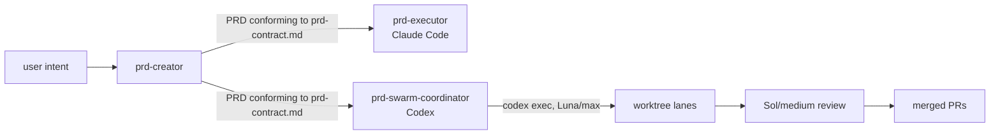

# PRD: `linchpin` — multi-runtime PRD pipeline plugin

**Complexity: 6 → MEDIUM mode**

```
+2  Touches 6-10 files
+2  New system/module from scratch (plugin repo, contract reference)
+2  Multi-package changes (ships to Claude Code + Codex from one skills/ dir)
```

---

## 1. Context

**Problem:** Four PRD skills exist as loose files linked three different ways; the
coordinator throws away the structure the creator emits, and the one delegation
mechanism that would break Luna is not written down anywhere.

**Files analyzed:**

- `~/.claude/skills/prd-creator/SKILL.md` (26048 B) — authoring standards
- `~/.claude/skills/prd-executor/SKILL.md` (8198 B) — single-PRD executor, Claude-native (`Task` agents)
- `~/.hermes/skills/autonomous-ai-agents/prd-swarm-coordinator/SKILL.md` (394 lines) — N-PRD → merged PRs, Codex-native (`codex exec`)
- `~/.hermes/skills/autonomous-ai-agents/swarm-coordinator/SKILL.md` (243 lines) — generic non-PRD swarm — **out of scope**
- `~/.codex/models_cache.json` — model capability source of truth
- `~/.claude/plugins/marketplaces/i-have-adhd/` — working multi-runtime plugin precedent
- `github.com/DannyMac180/sol-advisor` — reference implementation of the failure mode this PRD avoids

**Current behavior:**

- `prd-creator` is a **byte-identical copy** in `~/.codex/skills` and `~/.claude/skills` — no shared source.
- `prd-executor` is a symlink codex → claude. `prd-swarm-coordinator` and `swarm-coordinator` are symlinks codex → hermes and **absent from Claude Code entirely**.
- `prd-swarm-coordinator:23,116` says "read and normalize PRDs" and re-derives an acceptance checklist. It never mentions the Integration Ledger that `prd-creator` mandates.
- `prd-creator` mandates a negative control per gate; the coordinator invents its own lane gates instead of inheriting them.
- Model pins (`gpt-5.6-sol`/medium manager, `gpt-5.6-luna`/max worker) are hardcoded inline in ~6 places across two skills.
- Nothing in either skill states **why** Luna must run as a subprocess, so a future edit can silently convert it to a native subagent spawn and break every lane.

### Background: what "threads" means, and why Luna breaks

Codex has two ways to run a sub-agent. They are both loosely called "threads" and
they are not interchangeable:

| | **Native subagent thread (v2)** | **`codex exec` subprocess** |
|---|---|---|
| How | parent session calls a spawn tool with `agent_type:` + `fork_turns:` | a whole new Codex process; its session id names the rollout file |
| Resume | in-session | `codex exec resume <session-id>` |
| Requires | model has `multi_agent_version: "v2"` | nothing |
| Luna | **impossible** | works |

From `~/.codex/models_cache.json` on this machine:

| Model | `multi_agent_version` |
|---|---|
| gpt-5.6-sol | v2 |
| gpt-5.6-terra | v2 |
| **gpt-5.6-luna** | **v1** |

`sol-advisor` pins `sol_advisor_luna_implementer` as a **native v2 custom agent**.
Luna is v1. That is the entire content of the "luna is not v2 subagent compatible"
comment — its default implementation lane is built on a spawn mechanism its model
does not speak.

Our coordinator already uses `codex exec --model gpt-5.6-luna`, so it is correct
today **by accident of authorship, not by rule**. This PRD makes it a rule with a
gate. Terra is explicitly rejected on cost; there is no third tier.

---

## 2. Solution

**Approach:**

- One git repo, one `skills/` directory, thin per-runtime manifests — the
  `i-have-adhd` pattern already proven on this machine.
- Add `references/prd-contract.md`: the single spec for what a PRD artifact
  contains. `prd-creator` writes it, both executors read it.
- The coordinator stops normalizing conforming PRDs and lifts the Integration
  Ledger + acceptance checklist + negative controls straight into worker briefs.
- One `references/runtime.md` owns every model pin and the delegation rule.
  Future customization becomes an edit to one file (and later a
  `codex -p <profile>` layer), not a rewrite of three skills.
- Ship `scripts/verify.sh` that fails on any native-spawn reference to Luna.

**Runtime split by design (not an accident):**

| Skill | Runtime | Delegation |
|---|---|---|
| `prd-creator` | both | none — authoring only |
| `prd-executor` | Claude Code | `Task` subagents, single PRD |
| `prd-swarm-coordinator` | Codex | `codex exec` subprocesses, N PRDs → merged PRs |



**Key decisions:**

- [ ] No Terra tier. Cost. Escalation is by **corrected spec**, never by bigger model.
- [ ] Luna is never a native subagent. Enforced by `verify.sh`, not by convention.
- [ ] `swarm-coordinator` (generic, non-PRD) stays out of this plugin — different trigger surface, would dilute skill selection.
- [ ] Model pins centralized now; user-facing customization deferred to a follow-up PRD.

**Data changes:** None. Markdown and JSON manifests only.

---

## Integration Ledger

| # | New thing | Live caller (`file:line`, non-test) | Replaces | Old path removed? | Negative control |
|---|-----------|-------------------------------------|----------|-------------------|------------------|
| 1 | `references/prd-contract.md` | `skills/prd-swarm-coordinator/SKILL.md:TBD` (intake step reads it); `skills/prd-creator/SKILL.md:TBD` (declares conformance) | ad-hoc "read and normalize PRDs" at `prd-swarm-coordinator:23,116` | that wording deleted in Phase 1 | delete the contract file → coordinator intake step has a dangling reference and `verify.sh` fails |
| 2 | Integration-Ledger transfer into worker brief | `skills/prd-swarm-coordinator/SKILL.md:TBD` (worker-brief section) | coordinator's self-derived checklist | replaced in Phase 1 | a smoke-run brief that omits ledger rows must be rejected by the intake gate |
| 3 | Inherited negative controls as lane gates | `skills/prd-swarm-coordinator/SKILL.md:TBD` (verification section) | coordinator's invented gates | replaced in Phase 2 | a PRD whose gates have no observed-red evidence must fail lane acceptance |
| 4 | Spec-misclassification repair rule | `skills/prd-swarm-coordinator/SKILL.md:TBD` (retry/repair section) | "use a fresh Luna worker in the same worktree" | reworded in Phase 2 | an unchanged re-prompt must be refused by the rule text |
| 5 | `references/runtime.md` (model pins + delegation rule) | all three `SKILL.md` runtime sections | ~6 inline hardcoded pins | inlines replaced by citation in Phase 3 | change a pin in `runtime.md` → the skills must not contradict it; `verify.sh` greps for stray inline pins |
| 6 | `scripts/verify.sh` Luna-safety gate | `.github/workflows/verify.yml:TBD` and local pre-commit | nothing (new guard) | n/a | insert `agent_type: prd_luna_implementer` into a SKILL.md → `verify.sh` must exit non-zero |
| 7 | `.claude-plugin/` + `.codex-plugin/` manifests | Claude Code marketplace + `codex plugin add` | the copy in `~/.claude/skills/prd-creator` and symlinks in `~/.codex/skills` | deleted in Phase 5 | uninstall the plugin → `prd-creator` is no longer discoverable in either runtime |
| 8 | `skills/linchpin/SKILL.md` router | invoked directly as `$linchpin`; fans out to the three specific skills | nothing (new entry point) | n/a | invoke `$linchpin` with no PRDs present → must route to `prd-creator`, not silently no-op |
| 9 | `scripts/run-status.sh` (Phase 6) | `skills/prd-swarm-coordinator/SKILL.md:TBD` (goal objective) and the user's `/goal` | the goal judge reading a prose summary | n/a — the judge must never grade prose | point the goal at a run with one PARTIAL lane → the loop must continue, not report done |

### Reachability

**How will this feature be reached?**

- [ ] Entry point: `$linchpin` router skill (single memorable entry), or any of the three skills directly — `$linchpin:prd-creator` (Codex) / description-match auto-trigger (Claude Code)
- [ ] Pre-existing files that will be EDITED: all three `SKILL.md` files; `~/.codex/skills/` and `~/.claude/skills/` link targets
- [ ] Registration: `.claude-plugin/marketplace.json` + `.codex-plugin/plugin.json`, then `codex plugin add` / Claude Code marketplace add

**Is this user-facing?** YES — user-invoked skills. The "UI" is skill discovery and invocation; there is no separate component to build.

**Full flow:**
1. User asks for a PRD → `prd-creator` fires → writes a contract-conforming PRD.
2. User points the coordinator at N PRDs → intake reads `prd-contract.md`, skips normalization, lifts ledger + gates.
3. Coordinator spawns `codex exec --model gpt-5.6-luna` subprocesses — **never a native spawn**.
4. Result observable in: merged PRs whose lane evidence includes the PRD's own negative controls, observed red.

**What does this replace?**
- [ ] Replaces: the `prd-creator` duplicate copy, the three ad-hoc symlinks, and the coordinator's self-derived checklist → removed in Phase 1 and Phase 5.

---

## 4. Execution Phases

### Phase 0: Scaffold the repo and import the incumbent skills

*Every later phase edits `skills/**/SKILL.md`. Those paths do not exist yet. This phase creates them and nothing else.*

**Files (4):**
- `.gitignore` — NEW
- `skills/prd-creator/SKILL.md` — IMPORT (copy of `~/.claude/skills/prd-creator/SKILL.md`, 26048 B)
- `skills/prd-executor/SKILL.md` — IMPORT (copy of `~/.claude/skills/prd-executor/SKILL.md`, 8198 B)
- `skills/prd-swarm-coordinator/SKILL.md` — IMPORT (copy of `~/.hermes/skills/autonomous-ai-agents/prd-swarm-coordinator/SKILL.md`)

**Implementation:**
- [ ] `git init`; first commit is the three imports **verbatim, unmodified**, so every later diff is reviewable against the real starting point
- [ ] Do **not** delete or relink the originals — that is Phase 5, after the plugin is proven
- [ ] `swarm-coordinator` (generic) is not imported

**Wiring:** none yet — this phase intentionally connects nothing. It is the only phase exempt from "must edit a pre-existing file", because it creates the tree the rule operates on.

**Tests required:**

| Test | Assertion | Negative control (observe red) |
|---|---|---|
| `tests/import-fidelity.sh` | each imported `SKILL.md` is byte-identical to its source | change one byte in an import → must fail |

**Revert check:** n/a — nothing is wired yet. Phase 1 is the first phase with a revert check.

**User verification:** `git log --stat` shows one commit containing exactly three `SKILL.md` files at their original byte sizes.

---

### Phase 1: PRD contract — creator declares it, coordinator consumes it

*The coordinator stops re-deriving a checklist and uses the Integration Ledger the creator already wrote.*

**Files (3):**
- `references/prd-contract.md` — NEW: canonical PRD section spec (Integration Ledger, Execution Phases, Negative Controls, Acceptance Criteria, Checkpoint Protocol) + a machine-checkable conformance marker
- `skills/prd-creator/SKILL.md` — EDIT: declares output conforms; emits the marker
- `skills/prd-swarm-coordinator/SKILL.md` — EDIT: intake branches on the marker; conforming PRDs skip normalization and pass ledger rows verbatim into the worker brief

**Implementation:**
- [ ] Extract the contract from what `prd-creator` already emits — do not invent new sections
- [ ] Define the conformance marker (front-matter key, e.g. `prd_contract: v1`)
- [ ] Replace `prd-swarm-coordinator:23,116` normalization wording with the branch
- [ ] Worker brief gains a required **Integration Ledger** block: every row, `Live caller` and `Negative control` included

**Wiring:**
- [ ] Caller edited: coordinator intake step cites `references/prd-contract.md`
- [ ] Old path: normalization wording deleted for conforming PRDs, retained for legacy ones
- [ ] Ledger rows filled: #1, #2

**Tests required:**

| Test | Assertion | Negative control (observe red) |
|---|---|---|
| `tests/contract-conformance.sh` | a fixture PRD with the marker parses; every ledger row yields caller + control | strip the marker → the fixture must be routed to the legacy normalize path, not silently accepted |
| `tests/brief-contains-ledger.sh` | generated worker brief contains every ledger row | delete a row from the fixture → brief generation must fail, not emit a short brief |

**Revert check:** delete `references/prd-contract.md` → `verify.sh` fails on the dangling reference and the conformance test errors.

**User verification:** run `prd-creator` on a small feature, then point the coordinator at it — the worker brief printed to `reports/` must contain the Integration Ledger verbatim.

---

### Phase 2: Negative controls become lane gates; escalation is by spec, not by model

**Files (2):**
- `skills/prd-swarm-coordinator/SKILL.md` — EDIT: verification section inherits the PRD's negative controls as the lane's required gates; repair section gains the misclassification rule
- `references/prd-contract.md` — EDIT: specify the observed-red evidence format the coordinator will demand

**Implementation:**
- [ ] Lane acceptance requires each PRD gate recorded with its observed-red evidence; a gate with no red is reported `UNVERIFIED`, never `PASS`
- [ ] Sol/medium review packet includes the negative-control table so the reviewer checks controls, not just green
- [ ] Repair rule: *a failed Luna attempt is evidence the spec was wrong, not that the worker was weak.* The manager rewrites/narrows the spec before re-delegating. Never re-run an unchanged prompt. **Never escalate by switching model** — there is no second tier.

**Wiring:**
- [ ] Caller edited: coordinator verification + repair sections
- [ ] Old path: coordinator's invented gates removed; `prd-swarm-coordinator:327` retry wording reworded to name spec correction as the required change
- [ ] Ledger rows filled: #3, #4

**Tests required:**

| Test | Assertion | Negative control (observe red) |
|---|---|---|
| `tests/gate-evidence.sh` | lane acceptance rejects a report whose gates have no observed-red line | supply a report with all-green-never-red gates → must be rejected; supply one with red evidence → accepted |
| `tests/no-model-escalation.sh` | no SKILL.md contains a repair path that changes model tier | add `--model gpt-5.6-terra` to a repair snippet → must fail |

**Revert check:** remove the inherited-gates paragraph → `gate-evidence.sh` accepts an all-green report, which is the failure this phase exists to prevent.

---

### Phase 3: Luna safety rail + centralized runtime pins

*The phase that makes the "luna doesn't break" guarantee mechanical.*

**Files (4):**
- `references/runtime.md` — NEW: the only place model + effort + delegation mechanism are stated
- `scripts/verify.sh` — NEW: Luna-safety gate + stray-pin gate
- `skills/prd-swarm-coordinator/SKILL.md` — EDIT: runtime section cites `runtime.md`
- `skills/prd-executor/SKILL.md` — EDIT: runtime section cites `runtime.md`

**`references/runtime.md` must state, as a hard rule:**

> Luna runs **only** as a `codex exec` subprocess. It must never be spawned as a
> native subagent (`agent_type:` / `fork_turns:`), because `gpt-5.6-luna` reports
> `multi_agent_version: "v1"` and the native spawn tool speaks v2. Sol is v2-capable
> but is still invoked via `codex exec --sandbox read-only` so the reviewer role is
> **enforced** rather than requested.

**Implementation:**
- [ ] Move the manager pin (`gpt-5.6-sol` / medium) and worker pin (`gpt-5.6-luna` / max) into `runtime.md`; skills cite it
- [ ] `verify.sh` gate A: fail if any `skills/**/*.md` mentions `agent_type` or `fork_turns` near a Luna reference
- [ ] `verify.sh` gate B: fail if a model slug is hardcoded in a SKILL.md outside a fenced example that cites `runtime.md`
- [ ] `verify.sh` gate C: preflight helper the coordinator runs — read `$CODEX_HOME/models_cache.json`, assert `gpt-5.6-luna` exists and that the lane's mechanism is `exec`; fail loudly, never fall back
- [ ] Record `codex exec resume <session-id>` as the sanctioned continuation mechanism, so "resume the thread" has one unambiguous meaning

**Wiring:**
- [ ] Caller edited: both runtime sections now reference `runtime.md`
- [ ] Registration: `verify.sh` invoked from `.github/workflows/verify.yml`
- [ ] Old path: ~6 inline pins deleted
- [ ] Ledger rows filled: #5, #6

**Tests required:**

| Test | Assertion | Negative control (observe red) |
|---|---|---|
| `tests/luna-never-native.sh` | `verify.sh` exits 0 on the clean tree | insert `agent_type: prd_luna_implementer` into a SKILL.md → **must exit non-zero**; this is the gate that would have caught sol-advisor's bug |
| `tests/no-stray-pins.sh` | no hardcoded slug outside `runtime.md` | add `--model gpt-5.6-luna` to a skill body → must fail |
| `tests/preflight-model.sh` | preflight passes against real `models_cache.json` | point it at a fixture cache with Luna absent → must fail, not fall back |

**Revert check:** delete `references/runtime.md` → both skills have dangling citations and `verify.sh` gate B has no allowlist source, so `verify.sh` fails.

**User verification:** `sh scripts/verify.sh` on a clean tree → exit 0. Add a native-spawn line for Luna → non-zero with the offending `file:line`.

---

### Phase 4: Multi-runtime plugin repo

**Files (5):**
- `.claude-plugin/plugin.json` — NEW
- `.claude-plugin/marketplace.json` — NEW
- `.codex-plugin/plugin.json` — NEW (`"skills": "./skills/"`)
- `skills/linchpin/SKILL.md` — NEW: the router (see below)
- `README.md` — NEW: what it is, install for both runtimes, the Luna rule

The three `SKILL.md` files already live in `skills/` (Phase 0) and have been edited by
Phases 1–3, so this phase edits pre-existing files as required.

**The router skill — why `$linchpin` works alone:**

OpenAI's own plugins do this: the `documents` plugin ships one skill also named
`documents`. Plugin name == skill name gives a single clean entry token. So
`skills/linchpin/SKILL.md` is a thin router whose description covers the whole
pipeline and whose body dispatches on repo state:

| State on invocation | Routes to |
|---|---|
| no PRD in `docs/PRDs/` | `prd-creator` |
| one contract-conforming PRD, Claude Code | `prd-executor` |
| two or more conforming PRDs, Codex | `prd-swarm-coordinator` |
| PRDs present but non-conforming | `prd-creator` in upgrade mode |

The three specific skills keep their own sharp descriptions so they still
auto-trigger. The router is an addition, not a gate — it must never be the only
path to a skill.

**Implementation:**
- [ ] Copy the manifest shape from `~/.claude/plugins/marketplaces/i-have-adhd/`
- [ ] Both manifests point at the same `./skills/` dir
- [ ] Write the router; its description must not be so broad it hijacks unrelated tasks
- [ ] Push

**Wiring:**
- [ ] Registration: `codex plugin marketplace add <path>` + `codex plugin add linchpin@linchpin`; Claude Code marketplace add
- [ ] Ledger rows filled: #7, #8

**Tests required:**

| Test | Assertion | Negative control (observe red) |
|---|---|---|
| `tests/manifests-valid.sh` | `jq empty` on all three manifests; both point at `./skills/` | break the JSON → must fail |
| `tests/skills-discoverable.sh` | after install, `codex plugin list --json` shows the plugin and all four skills | uninstall → must disappear |
| `tests/router-dispatch.sh` | each of the four repo states routes to the expected skill | delete the router → the three skills must **still** be invocable directly; if they are not, the router became a gate |

**Revert check:** uninstall the plugin → `$linchpin` and `$linchpin:prd-creator` are both unresolvable in Codex.

**User verification:** install in Codex, start a **fresh task**, type `$linchpin` in an empty repo — it must route to `prd-creator`.

---

### Phase 5: Install swap — delete the incumbents

*Without this phase, two live copies of every skill exist and the plugin is dead by construction.*

**Files (4 link targets, all pre-existing):**
- `~/.claude/skills/prd-creator/` — DELETE (the duplicate copy)
- `~/.claude/skills/prd-executor/` — DELETE (now shipped by the plugin)
- `~/.codex/skills/prd-creator`, `~/.codex/skills/prd-executor`, `~/.codex/skills/prd-swarm-coordinator` — DELETE symlinks
- `~/.hermes/skills/autonomous-ai-agents/prd-swarm-coordinator/` — DELETE after confirming the repo is its source of truth

**Implementation:**
- [ ] Back up each target before deletion (`~/projects/linchpin/.migration-backup/`)
- [ ] Verify byte-equality between each incumbent and the plugin copy **before** deleting
- [ ] Delete; confirm each runtime resolves the skill from the plugin only
- [ ] Leave `swarm-coordinator` (generic) untouched — out of scope

**Wiring:**
- [ ] Old path: all incumbents deleted; exactly one live copy of each skill remains
- [ ] Ledger row completed: #7 `Old path removed?`

**Tests required:**

| Test | Assertion | Negative control (observe red) |
|---|---|---|
| `tests/no-duplicate-skills.sh` | exactly one resolvable source per skill name across `~/.codex/skills`, `~/.claude/skills`, and plugin dirs | restore one backup copy → must report the duplicate |
| `tests/post-swap-invoke.sh` | each skill still invokes in its runtime after deletion | — |

**Revert check:** this phase's whole point — after deletion, invoking `prd-creator` must still work, proving the plugin (not the old copy) is what serves it.

**User verification (manual — HIGH-risk deletion):** confirm backups exist, then invoke all three skills in a fresh session of each runtime.

---

### Phase 6 (OPTIONAL — do not start until Phases 1–5 are merged): goal-loop completion driver

*Turns "no lane ends silently PARTIAL" from an assertion into a mechanism.*

Codex and Hermes both ship a Ralph loop (`/goal`): after each turn a judge model
asks "is the goal satisfied?", and if not it injects a continuation prompt until
done or the token budget is spent. State lives in `thread_goals`
(`~/.codex/goals_1.sqlite`) and `~/.hermes/hermes-agent/hermes_cli/goals.py`.

**The trap this phase must avoid.** That judge grades **the assistant's last
response**. This entire plugin exists because a worker saying DONE is not
evidence. A naive goal — *"implement all the PRDs"* — has the judge read the
manager's summary and rule done, reinstating exactly the failure mode Phases 1–3
remove. The goal objective must therefore point at a **command's stdout**, never
at prose.

**Files (3):**
- `scripts/run-status.sh` — NEW: reads the run ledger, prints one line per lane (`MERGED` / `BLOCKED <reason> <resume-cmd>` / `PARTIAL`), exits non-zero while any lane is `PARTIAL`
- `skills/prd-swarm-coordinator/SKILL.md` — EDIT: after intake, **offer** to arm the goal; never arm it unprompted
- `references/runtime.md` — EDIT: document the goal contract and the mandatory explicit token budget

**Why not a `SessionStart` hook:** plugins have no "start" event. The only auto-trigger
is `SessionStart`, which fires on every session including the ones with nothing to do
with PRDs — a goal armed there burns budget continuing work nobody asked for. Arming
happens at coordinator intake, once the lane count is known, and only on request.

**The armed objective must look like this:**

```
/goal Every lane in run <run-id> reports MERGED, or BLOCKED with a named external
      blocker and a resumable next command. Verify by running
      `scripts/run-status.sh <run-id>` and judging ONLY its stdout and exit code.
      Never judge a summary. token_budget: <explicit value>
```

**Implementation:**
- [ ] `run-status.sh` reads the ledger only; it never asks a model anything
- [ ] Opt-in phrase required ("run it to completion"); default is no goal
- [ ] Explicit `token_budget` — never inherit the default
- [ ] A `BLOCKED` lane with evidence satisfies the goal; a `PARTIAL` lane never does

**Wiring:**
- [ ] Caller edited: coordinator intake gains the offer step
- [ ] Ledger row filled: #9

**Tests required:**

| Test | Assertion | Negative control (observe red) |
|---|---|---|
| `tests/run-status-exit.sh` | exits non-zero while any lane is `PARTIAL`, zero when all are `MERGED`/`BLOCKED`+evidence | flip a fixture lane to `PARTIAL` → must go non-zero |
| `tests/goal-judges-stdout.sh` | the armed objective text names `run-status.sh` and forbids judging summaries | remove the "never judge a summary" clause → must fail |
| `tests/goal-not-auto-armed.sh` | no `SessionStart` hook and no unprompted arming anywhere in the repo | add a `hooks/` entry that arms a goal → must fail |

**Revert check:** delete `run-status.sh` → the coordinator's offer step has a dangling reference and `verify.sh` fails.

**User verification (manual — spends money):** arm the goal on a two-PRD run where one lane is deliberately left incomplete. The loop must keep going, not report done.

---

## 5. Checkpoint protocol

Automated checkpoint after every phase — spawn `prd-work-reviewer` with the standard
integration audit. Phases 3, 5, and 6 additionally require a **manual** checkpoint:
Phase 3 because the Luna gate is the project's core guarantee, Phase 5 because it
deletes files outside the repo, Phase 6 because a goal loop spends money autonomously.

---

## 7. Acceptance criteria

Consumer-scoped:

- [ ] A PRD written by `linchpin:prd-creator` is executed end-to-end by `linchpin:prd-swarm-coordinator` **without the coordinator re-deriving an acceptance checklist**, and the Integration Ledger appears verbatim in the worker brief
- [ ] A lane whose gates were never observed red is **rejected**, not merged
- [ ] Adding a native-spawn reference for Luna to any skill makes `scripts/verify.sh` exit non-zero, naming the file and line
- [ ] Changing the worker model in `references/runtime.md` alone changes what the coordinator actually launches — no skill body edit needed
- [ ] Both runtimes resolve all four skills from the plugin, and no second copy of any skill exists on disk
- [ ] Typing `$linchpin` alone in an empty repo starts a PRD; deleting the router leaves the three skills directly invocable
- [ ] A failed lane is retried with a corrected spec; no retry path anywhere switches model tier
- [ ] (Phase 6, if built) A run with one incomplete lane keeps the goal loop running; the loop is never armed without an explicit request

**Integration gates:**

- [ ] Integration Ledger has zero `TBD` cells; every live caller is a real non-test `file:line`
- [ ] Caller census pasted for `prd-contract.md`, `runtime.md`, and `verify.sh`
- [ ] Revert check passed for every phase
- [ ] Every `Replaces` row's old path deleted or delegating — Phase 5 closes this
- [ ] Every gate has a negative control observed failing
- [ ] Proved on the real subject: the first coordinator run uses a **real multi-PRD batch in a real repo**, not a toy fixture

## Out of scope (follow-up PRD)

- User-facing model customization (`codex -p <profile>` layering, per-role overrides). Phase 3 only centralizes the pins so this becomes a config change.
- `swarm-coordinator` (generic, non-PRD).
- Terra or any third model tier — rejected on cost.
