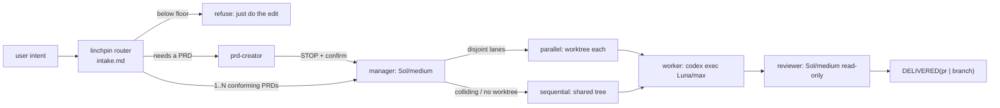

# PRD: `linchpin` — Codex PRD swarm plugin

**Complexity: 5 → MEDIUM mode**

```text
+3  Touches 10+ files (3 skills, 3 references, 2 scripts, manifest, README, CI, tests)
+2  New system/module from scratch (plugin repo, contract + intake references)
```

---

## 1. Context

**The goal, stated plainly:** an agent swarm that orchestrates execution of **one or
many PRDs** through a manager and workers. Manager is `gpt-5.6-sol` at medium.
Workers are `gpt-5.6-luna` at max. Everything else in this PRD exists to make that
work reliably, or to stop it from silently not working.

**Problem:** Four PRD skills exist as loose files linked three different ways; the
coordinator throws away the structure the creator emits; the one delegation
mechanism that would break Luna is not written down anywhere; nothing decides what
happens when the input is not already a conforming PRD; and the parallelism
mechanism has no fallback when it is unavailable.

**Files analyzed:**

- `~/.claude/skills/prd-creator/SKILL.md` (26048 B) — authoring standards
- `~/.claude/skills/prd-executor/SKILL.md` (8198 B) — single-PRD executor, Claude-native (`Task` agents)
- `~/.hermes/skills/autonomous-ai-agents/prd-swarm-coordinator/SKILL.md` (394 lines) — N-PRD → merged PRs, Codex-native (`codex exec`)
- `~/.hermes/skills/autonomous-ai-agents/swarm-coordinator/SKILL.md` (243 lines) — generic non-PRD swarm — **out of scope**
- `~/.codex/models_cache.json` — model capability source of truth
- `~/.codex/plugins/cache/openai-curated/github/11c74d6b/.codex-plugin/plugin.json` — real Codex manifest shape
- `~/.codex/config.toml:305-342` — the entire user-facing plugin config surface
- `github.com/DannyMac180/sol-advisor` — reference implementation of the failure mode this PRD avoids

**Current behavior:**

- `prd-creator` is a **byte-identical copy** in `~/.codex/skills` and `~/.claude/skills` — no shared source.
- `prd-executor` is a symlink codex → claude. `prd-swarm-coordinator` and `swarm-coordinator` are symlinks codex → hermes.
- `prd-swarm-coordinator:23,116` says "read and normalize PRDs" and re-derives an acceptance checklist. It never mentions the Integration Ledger that `prd-creator` mandates.
- `prd-creator` mandates a negative control per gate; the coordinator invents its own lane gates instead of inheriting them.
- Model pins (`gpt-5.6-sol`/medium manager, `gpt-5.6-luna`/max worker) are hardcoded inline in ~6 places across two skills.
- Nothing states **why** Luna must run as a subprocess, so a future edit can silently convert it to a native subagent spawn and break every lane.
- **One PRD and many PRDs are two different skills** with two different delegation mechanisms, for no reason that survives the goal statement above.
- **Nothing defines what happens on any input that is not already a conforming PRD** — a bare feature request, a trivial request, a non-conforming PRD, a repo with no remote. All undefined today.
- **Worktrees have no fallback.** When `git worktree` is unavailable, or two PRDs touch the same files, there is no defined behavior.

### Background: what "threads" means, and why Luna breaks

Codex has two ways to run a sub-agent. They are both loosely called "threads" and
they are not interchangeable:

| | **Native subagent thread (v2)** | **`codex exec` subprocess** |
|---|---|---|
| How | parent session calls a spawn tool with `agent_type:` + `fork_turns:` | a whole new Codex process; its session id names the rollout file |
| Resume | in-session | `codex exec resume <session-id>` |
| Requires | model has `multi_agent_version: "v2"` | nothing |
| Luna | **impossible** | works |

From `~/.codex/models_cache.json` on this machine:

| Model | `multi_agent_version` |
|---|---|
| gpt-5.6-sol | v2 |
| gpt-5.6-terra | v2 |
| **gpt-5.6-luna** | **v1** |

`sol-advisor` pins `sol_advisor_luna_implementer` as a **native v2 custom agent**.
Luna is v1. That is the entire content of the "luna is not v2 subagent compatible"
comment — its default implementation lane is built on a spawn mechanism its model
does not speak.

Our coordinator already uses `codex exec --model gpt-5.6-luna`, so it is correct
today **by accident of authorship, not by rule**. This PRD makes it a rule with a
gate. Terra is explicitly rejected on cost; there is no third tier.

### Background: Codex plugins cannot take options

Verified against a real installed plugin. The manifest schema is:

```text
name, version, description, author, homepage, repository, license,
keywords, skills, apps, mcpServers, interface
```

No settings schema, no options block, no typed config. The entire user-facing
surface in `~/.codex/config.toml` is one key per plugin:

```toml
[plugins."linchpin@linchpin"]
enabled = true
```

**Therefore all configurability in this plugin is a file a skill reads**, not a
platform feature. That constraint drives Phase 2.

---

## 2. Solution

### The swarm

One orchestration model, used for every run:

| Role | Model | Effort | Count | Mechanism | Owns |
|---|---|---|---|---|---|
| **Manager** | `gpt-5.6-sol` | medium | 1 per run | the session you are in | intake, worker briefs, review, repair, ledger |
| **Worker** | `gpt-5.6-luna` | max | 1 per lane | `codex exec` subprocess | one PRD, start to delivery |
| **Reviewer** | `gpt-5.6-sol` | medium | 1 per lane | `codex exec --sandbox read-only` | lane acceptance against inherited gates |

**A single PRD is a swarm of one.** It takes the same path — same manager, same
brief format, same gates, same review, same ledger. There is no separate
single-PRD code path, because a separate path is a second thing to keep correct.

**This merges `prd-executor` into `prd-swarm-coordinator`** (Phase 2). Three skills
ship, not four.

### Execution modes — parallel is the default, sequential is the fallback

| Mode | Isolation | When |
|---|---|---|
| `parallel` | one git worktree per lane | default, whenever worktrees work and the lanes' file sets are disjoint |
| `sequential` | shared working tree, one lane at a time | **fallback — announced, never a refusal** |

Sequential is triggered by, per lane group:

- `git worktree add` unavailable or failing (submodules, unusual repo setups, disk)
- working tree dirty in a way that cannot be stashed
- two or more PRDs whose `Files (N)` lists intersect
- `max_lanes = 1`, or the user asked for sequential
- lanes depend on untracked build state that does not survive a fresh worktree

**Degradation is per lane group, not all-or-nothing.** If lanes A and B collide but
C and D are disjoint, A→B run sequentially while C and D run in parallel. The
manager schedules; the workers never know the difference.

Both modes use the same worker brief, the same gates, and the same delivery. Mode
changes *where* a worker runs, never *what it is asked to do*.

### Everything else

- One git repo, one `skills/` directory, one Codex manifest.
- `references/prd-contract.md`: the single spec for what a PRD artifact contains. `prd-creator` writes it, the coordinator reads it.
- `references/intake.md`: the single spec for everything that is not already a conforming PRD — intent routing, complexity floor, capability preflight, `.linchpin.toml`, execution-mode selection.
- `references/runtime.md`: every model pin and the delegation rule, in one file.
- `scripts/verify.sh`: fails on any native-spawn reference to Luna.



**Key decisions:**

- [ ] **One skill executes, for 1 or N PRDs.** `prd-executor` merges into `prd-swarm-coordinator`.
- [ ] **Codex only in v1.** Claude Code support is a later manifest add; skill bodies stay runtime-neutral.
- [ ] **Worktrees are the default lane isolation, not a requirement.** Unavailable → sequential, announced. Never a refusal.
- [ ] No Terra tier. Cost. Escalation is by **corrected spec**, never by bigger model.
- [ ] Luna is never a native subagent. Enforced by `verify.sh`, not by convention.
- [ ] **Plugins take no options; config is `.linchpin.toml` in the target repo, always optional.** Zero-config must work.
- [ ] **Degradation is announced, never silent.** Every fallback names what was missing before it takes effect.
- [ ] **`prd-creator` → execution is never automatic.** Always a confirmation point.
- [ ] `swarm-coordinator` (generic, non-PRD) stays out — different trigger surface, would dilute skill selection.

**Data changes:** None. Markdown, TOML, JSON, shell.

---

## 3. Defaults and configuration

### `.linchpin.toml` — repo-local, every key optional

```toml
# Omit this file entirely and the defaults below apply.
execution = "auto"    # auto | parallel | sequential
delivery  = "pr"      # pr | branch
base      = "auto"    # auto = repo default branch
review    = true
max_lanes = 4
prd_floor = 3
```

Written by the manager when the user overrides in natural language ("run these but
don't open PRs" → writes `delivery = "branch"`), so the conversational path and the
file path converge instead of competing.

### Defaults, and why

| Axis | Default | Rationale |
|---|---|---|
| `execution` | `auto` | Parallel when worktrees work and lanes are disjoint; sequential per colliding group. `parallel` forces it and **fails loudly** rather than degrading — that is the only way to find out worktrees are broken. |
| `delivery` | `pr` | The reviewer needs a diff artifact. Degrades to `branch` when no remote or no `gh`, announced. |
| `base` | repo default branch | All lanes branch from the same base. Lanes must **never** branch off each other — that turns N independent reviews into a chain. |
| `review` | `true` | It is the product. `review = false` must be typed, never inferred. |
| `max_lanes` | `4` | Each lane is a Luna/max subprocess. Unbounded fan-out on a 9-PRD batch is a budget accident. Excess lanes queue. |
| `prd_floor` | `3` | See below. |

### The complexity floor

`prd-creator`'s scale bottoms out at 1 (`+1 touches 1-5 files`), so **every** task
scores at least 1 and LOW mode covers both "small feature" and "rename a
variable". linchpin adds a band below LOW that `prd-creator` does not have:

| Score | linchpin behavior |
|---|---|
| ≤ 2 | **Refuse the pipeline.** Say so, do the edit directly. |
| 3–6 | `prd-creator` LOW/MEDIUM → confirm → swarm |
| 7+ | `prd-creator` HIGH → confirm → swarm |

This is what stops `$linchpin` from hijacking trivial work.

### The two mandatory confirmation points

1. **`prd-creator` never auto-chains into execution.** It writes the PRD, then
   stops and asks. Auto-chaining is the same failure Phase 7 names — burning budget
   continuing work nobody asked for — just earlier in the pipeline.
2. **Every degrade is announced before it takes effect.**
   *"`git worktree` failed (repo has submodules) — running 3 lanes sequentially in
   the working tree instead. Continue?"*

### Capability preflight

| Check | On failure |
|---|---|
| is a git repo | **refuse**, name it — there is no lane without version control |
| `$CODEX_HOME/models_cache.json` has `gpt-5.6-luna` | **refuse**, never fall back |
| `git worktree add` succeeds | → `sequential`, **announce** |
| working tree clean or stashable | → `sequential`, **announce** |
| lanes' `Files (N)` sets disjoint | colliding group → `sequential`, **announce** |
| has remote + `gh` | `delivery` → `branch`, **announce** |

Exactly two refusals: no git, no Luna. Everything else degrades.

### Lane terminal states

`DELIVERED(<mode>)` / `BLOCKED <reason> <resume-cmd>` / `PARTIAL`.

Not `MERGED` — that word bakes `delivery = "pr"` into the run ledger's vocabulary
and makes branch delivery a redesign instead of a config value.

---

## Integration Ledger

| # | New thing | Live caller (`file:line`, non-test) | Replaces | Old path removed? | Negative control |
|---|-----------|-------------------------------------|----------|-------------------|------------------|
| 1 | `references/prd-contract.md` | intake reads it at `skills/prd-swarm-coordinator/SKILL.md:13`; declares conformance at `skills/prd-creator/SKILL.md:14` | ad-hoc "read and normalize PRDs" at `prd-swarm-coordinator:23,116` | that wording deleted in Phase 1 | delete the contract file → intake has a dangling reference and `verify.sh` fails |
| 2 | Integration-Ledger transfer into worker brief | worker-brief section at `skills/prd-swarm-coordinator/SKILL.md:67` | coordinator's self-derived checklist | replaced in Phase 1 | a brief that omits ledger rows must be rejected by the intake gate |
| 3 | Machine-readable `Files (N)` lists | `skills/prd-swarm-coordinator/SKILL.md:85` (mode selection); `scripts/linchpin.sh:45` | prose file lists | prose form deleted from the contract in Phase 1 | malform a list → mode selection must fail, not assume disjoint |
| 4 | `references/intake.md` | `skills/linchpin/SKILL.md:8`; `skills/prd-swarm-coordinator/SKILL.md:42` | undefined behavior on non-PRD input | n/a (new) | delete it → router has no dispatch rule and `verify.sh` fails |
| 5 | Unified 1..N execution path | `skills/prd-swarm-coordinator/SKILL.md:11` | `skills/prd-executor/SKILL.md` entirely | **skill deleted** in Phase 2 | run a single PRD → must produce the same brief format, gates, and ledger row as a lane in an N-PRD run |
| 6 | `execution` mode selector + sequential fallback | `scripts/linchpin.sh:273`; `skills/prd-swarm-coordinator/SKILL.md:96` | unconditional worktree assumption | assumption replaced in Phase 2 | make `git worktree add` fail → must run sequentially **and announce**, never abort |
| 7 | `.linchpin.toml` reader | `scripts/linchpin.sh:202`; `skills/prd-swarm-coordinator/SKILL.md:48` | hardcoded `pr`/worktree/review-on assumptions | inlines replaced in Phase 2 | delete the file → all defaults apply and the run proceeds; make it required → test fails |
| 8 | Complexity-floor refusal | `skills/linchpin/SKILL.md:27`; `scripts/linchpin.sh:246` | nothing (new guard) | n/a | a score-2 request must be refused, not turned into a PRD |
| 9 | `prd-creator` upgrade mode | `skills/linchpin/SKILL.md:31`; `skills/prd-creator/SKILL.md:40` | the coordinator's "legacy normalize" fallback | legacy path **deleted** in Phase 2 | feed a non-conforming PRD → must be rewritten to conform, never normalized in-flight |
| 10 | Inherited negative controls as lane gates | `skills/prd-swarm-coordinator/SKILL.md:123`; `scripts/linchpin.sh:360` | coordinator's invented gates | replaced in Phase 3 | a PRD whose gates have no observed-red evidence must fail lane acceptance |
| 11 | Spec-misclassification repair rule | `skills/prd-swarm-coordinator/SKILL.md:152` | "use a fresh Luna worker in the same worktree" | reworded in Phase 3 | an unchanged re-prompt must be refused by the rule text |
| 12 | `references/runtime.md` (pins + roles + delegation rule) | `skills/prd-creator/SKILL.md:49`; `skills/prd-swarm-coordinator/SKILL.md:14`; `skills/linchpin/SKILL.md:9` | ~6 inline hardcoded pins | inlines replaced by citation in Phase 4 | change a pin in `runtime.md` → skills must not contradict it; `verify.sh` greps for stray inline pins |
| 13 | `scripts/verify.sh` Luna-safety gate | `.github/workflows/verify.yml:18`; `scripts/verify.sh:50` | nothing (new guard) | n/a | insert `agent_type: prd_luna_implementer` into a SKILL.md → `verify.sh` must exit non-zero |
| 14 | `.codex-plugin/plugin.json` + marketplace | `.codex-plugin/plugin.json:5` | the copy in `~/.claude/skills/prd-creator` and symlinks in `~/.codex/skills` | blocked until owner confirms Phase 6 swap | uninstall → `prd-creator` is no longer discoverable |
| 15 | `skills/linchpin/SKILL.md` router | `skills/linchpin/SKILL.md:13`; `.codex-plugin/plugin.json:7` | nothing (new entry point) | n/a | invoke `$linchpin` → must dispatch per `intake.md`, not silently no-op |
| 16 | `scripts/run-status.sh` (Phase 7) | `optional/unbuilt: no Phase 1-6 merge checkpoint in this run` | the goal judge reading a prose summary | n/a — optional phase not started | no goal-loop reference is emitted before an explicit checkpoint |

### Reachability

**How will this feature be reached?**

- [ ] Entry point: `$linchpin` router, or either skill directly (`$linchpin:prd-creator`, `$linchpin:prd-swarm-coordinator`)
- [ ] Discovery surface: `interface.defaultPrompt` in `.codex-plugin/plugin.json` carries the one-line pitch, so the router's own description can stay narrow
- [ ] Pre-existing files EDITED: all three imported `SKILL.md` files; `~/.codex/skills/` and `~/.claude/skills/` link targets
- [ ] Registration: `.codex-plugin/plugin.json`, then `codex plugin marketplace add` / `codex plugin add`

**Is this user-facing?** YES — user-invoked skills. The "UI" is skill discovery and invocation.

**Full flow:**
1. User expresses intent → router reads `intake.md`, classifies, scores, preflights.
2. Below floor → refuse and do the edit. Above → `prd-creator` writes 1..N conforming PRDs, **then stops and confirms**.
3. On confirm: manager (Sol/medium) parses `Files (N)` lists, picks parallel or sequential per lane group, **announces any degrade**.
4. Manager spawns `codex exec --model gpt-5.6-luna` workers — **never a native spawn**. One PRD is a swarm of one.
5. Reviewer (Sol/medium, read-only) checks each lane against the PRD's own negative controls, observed red.
6. Result observable in: `DELIVERED(<mode>)` lanes in the run ledger.

**What does this replace?**
- [ ] Replaces: the `prd-creator` duplicate copy, the three ad-hoc symlinks, `prd-executor` entirely, the coordinator's self-derived checklist, and its legacy-normalize fallback → removed in Phases 1, 2, and 6.

---

## 4. Execution Phases

### Phase 0: Scaffold the repo and import the incumbent skills

*Every later phase edits `skills/**/SKILL.md`. Those paths do not exist yet.*

**Files (4):**
- `.gitignore` — NEW
- `skills/prd-creator/SKILL.md` — IMPORT (copy of `~/.claude/skills/prd-creator/SKILL.md`, 26048 B)
- `skills/prd-executor/SKILL.md` — IMPORT (copy of `~/.claude/skills/prd-executor/SKILL.md`, 8198 B) — imported to be harvested and deleted in Phase 2
- `skills/prd-swarm-coordinator/SKILL.md` — IMPORT (copy of `~/.hermes/skills/autonomous-ai-agents/prd-swarm-coordinator/SKILL.md`)

**Implementation:**
- [ ] `git init`; first commit is the three imports **verbatim, unmodified**, so every later diff is reviewable against the real starting point
- [ ] `prd-executor` is imported even though it will not ship — Phase 2 needs its single-PRD logic in version control before absorbing it
- [ ] Do **not** delete or relink the originals — that is Phase 6
- [ ] `swarm-coordinator` (generic) is not imported

**Wiring:** none yet. This is the only phase exempt from "must edit a pre-existing file", because it creates the tree the rule operates on.

**Tests required:**

| Test | Assertion | Negative control (observe red) |
|---|---|---|
| `tests/import-fidelity.sh` | each imported `SKILL.md` is byte-identical to its source | change one byte in an import → must fail |

**Revert check:** n/a — nothing is wired yet.

**User verification:** `git log --stat` shows one commit containing exactly three `SKILL.md` files at their original byte sizes.

---

### Phase 1: PRD contract — creator declares it, coordinator consumes it

*The coordinator stops re-deriving a checklist and uses the Integration Ledger the creator already wrote.*

**Files (3):**
- `references/prd-contract.md` — NEW: canonical PRD section spec (Integration Ledger, Execution Phases with **machine-readable** `Files (N)` lists, Negative Controls, Acceptance Criteria, Checkpoint Protocol) + a conformance marker
- `skills/prd-creator/SKILL.md` — EDIT: declares output conforms; emits the marker; emits parseable file lists
- `skills/prd-swarm-coordinator/SKILL.md` — EDIT: intake branches on the marker; ledger rows pass verbatim into the worker brief

**Implementation:**
- [ ] Extract the contract from what `prd-creator` already emits — do not invent new sections
- [ ] Define the conformance marker (front-matter key, e.g. `prd_contract: v1`)
- [ ] `Files (N)` lists must parse to a path list. **Phase 2's mode selection depends entirely on this** — unparseable lists must fail, never default to "assume disjoint"
- [ ] Replace `prd-swarm-coordinator:23,116` normalization wording with the branch
- [ ] Worker brief gains a required **Integration Ledger** block: every row, `Live caller` and `Negative control` included

**Wiring:**
- [ ] Caller edited: coordinator intake cites `references/prd-contract.md`
- [ ] Old path: normalization wording deleted for conforming PRDs
- [ ] Ledger rows filled: #1, #2, #3

**Tests required:**

| Test | Assertion | Negative control (observe red) |
|---|---|---|
| `tests/contract-conformance.sh` | a fixture PRD with the marker parses; every ledger row yields caller + control | strip the marker → must be flagged non-conforming, not silently accepted |
| `tests/brief-contains-ledger.sh` | generated worker brief contains every ledger row | delete a row from the fixture → brief generation must fail, not emit a short brief |
| `tests/files-list-parseable.sh` | each phase's `Files (N)` list parses to a path list | malform one list → must **fail**, never fall through to "disjoint" |

**Revert check:** delete `references/prd-contract.md` → `verify.sh` fails on the dangling reference and the conformance test errors.

**User verification:** run `prd-creator` on a small feature, then point the coordinator at it — the worker brief in `reports/` must contain the Integration Ledger verbatim.

---

### Phase 2: One execution path for 1..N PRDs, and everything that is not a conforming PRD

*Merges `prd-executor` into the coordinator, then defines the other four fifths of reality: bare feature requests, trivial requests, non-conforming PRDs, missing capabilities, colliding lanes.*

**Files (4):**
- `references/intake.md` — NEW: intent routing, complexity floor, capability preflight, `.linchpin.toml` schema + defaults, confirmation points, execution-mode selection
- `skills/prd-swarm-coordinator/SKILL.md` — EDIT: absorbs the single-PRD path; cites `intake.md`; adds mode selection + sequential fallback; legacy-normalize fallback **deleted**
- `skills/prd-creator/SKILL.md` — EDIT: gains **upgrade mode**; gains the hard stop before execution
- `skills/prd-executor/SKILL.md` — DELETE: merged into the coordinator

**The intent routing table (goes in `intake.md`, keyed on intent, not repo state):**

| User intent | Precondition | Routes to |
|---|---|---|
| "write a PRD for X" | — | `prd-creator` |
| "build / implement X", no PRD named | score ≥ 3 | `prd-creator` → **stop, confirm** |
| "build / implement X", no PRD named | score ≤ 2 | **refuse the pipeline**, do the edit directly |
| "run / execute" | 1..N conforming PRDs | `prd-swarm-coordinator` |
| any execute intent | any PRD non-conforming | `prd-creator` **upgrade mode**, then re-route |
| ambiguous | — | **ask once**, never guess |

Repo state is a tiebreaker, never the discriminator. A user with three PRDs on disk
who says *"fix the typo in phase 2"* must not get a swarm.

**Implementation:**
- [ ] Merge: the coordinator's lane logic becomes the only executor. N=1 takes the identical path — same brief, same gates, same review, same ledger row. No `if single` branch anywhere
- [ ] Delete `skills/prd-executor/SKILL.md`; harvest anything it does that the coordinator does not
- [ ] Write `intake.md`: routing table, floor, preflight, `.linchpin.toml`, confirmation points, mode selection
- [ ] **Mode selection:** parse every PRD's `Files (N)` lists, build the intersection graph, partition lanes into groups; disjoint groups run parallel, intersecting groups run sequential, and every degrade is announced with the reason
- [ ] **Sequential fallback:** on `git worktree add` failure or an unstashable dirty tree, run lanes one at a time in the working tree. **Announce, never abort.** The only refusals are "not a git repo" and "Luna missing"
- [ ] `execution = "parallel"` forces parallel and **fails loudly** instead of degrading — the only way to discover worktrees are broken
- [ ] `.linchpin.toml` read if present, ignored if absent; **zero-config must work end to end**
- [ ] Natural-language overrides write the equivalent key into `.linchpin.toml` so the choice persists
- [ ] Delete the coordinator's legacy-normalize fallback — non-conforming PRDs go through upgrade mode, producing a durable artifact instead of an in-flight guess
- [ ] Lane terminal vocabulary becomes `DELIVERED(<mode>)` / `BLOCKED` / `PARTIAL` throughout

**Wiring:**
- [ ] Caller edited: coordinator + creator intake sections cite `references/intake.md`
- [ ] Old path: `prd-executor` deleted; legacy-normalize wording deleted; inline `pr`/worktree/review-on assumptions replaced by `.linchpin.toml` defaults
- [ ] Ledger rows filled: #4, #5, #6, #7, #8, #9

**Tests required:**

| Test | Assertion | Negative control (observe red) |
|---|---|---|
| `tests/single-is-swarm-of-one.sh` | a 1-PRD run emits the same brief format, gates, and ledger row shape as one lane of a 3-PRD run | add an `if single` shortcut → the diff between the two must be non-empty and the test must fail |
| `tests/mode-selection.sh` | disjoint file sets → parallel; intersecting → those lanes sequential; mixed batch → per-group | make all lists disjoint → all-parallel; make all intersect → all-sequential |
| `tests/worktree-fallback.sh` | with `git worktree add` stubbed to fail, all lanes still complete **sequentially** and an announcement is emitted | suppress the announcement → must fail; abort instead of degrading → must fail |
| `tests/intent-routing.sh` | each routing-table row dispatches correctly | put 3 PRDs on disk and send "write a PRD for X" → must still route to `prd-creator`, proving intent beats state |
| `tests/config-optional.sh` | a run with **no** `.linchpin.toml` completes on defaults; a score-2 request is refused | make the file required → must fail |

**Revert check:** delete `references/intake.md` → the router has no dispatch rule, both skills have dangling citations, and `verify.sh` fails.

**User verification:** run a 2-PRD batch whose PRDs both name the same file. The manager must announce sequential scheduling for those two lanes and complete both — not refuse, not run them concurrently.

---

### Phase 3: Negative controls become lane gates; escalation is by spec, not by model

**Files (2):**
- `skills/prd-swarm-coordinator/SKILL.md` — EDIT: verification section inherits the PRD's negative controls as the lane's required gates; repair section gains the misclassification rule
- `references/prd-contract.md` — EDIT: specify the observed-red evidence format the reviewer will demand

**Implementation:**
- [ ] Lane acceptance requires each PRD gate recorded with its observed-red evidence; a gate with no red is `UNVERIFIED`, never `PASS`
- [ ] Reviewer packet includes the negative-control table so the reviewer checks controls, not just green
- [ ] Repair rule: *a failed Luna attempt is evidence the spec was wrong, not that the worker was weak.* The manager rewrites/narrows the spec before re-delegating. Never re-run an unchanged prompt. **Never escalate by switching model** — there is no second tier
- [ ] Gates apply identically in sequential mode — degrading isolation must never degrade acceptance

**Wiring:**
- [ ] Caller edited: coordinator verification + repair sections
- [ ] Old path: invented gates removed; `prd-swarm-coordinator:327` retry wording reworded to name spec correction as the required change
- [ ] Ledger rows filled: #10, #11

**Tests required:**

| Test | Assertion | Negative control (observe red) |
|---|---|---|
| `tests/gate-evidence.sh` | lane acceptance rejects a report whose gates have no observed-red line | all-green-never-red report → rejected; report with red evidence → accepted |
| `tests/no-model-escalation.sh` | no SKILL.md contains a repair path that changes model tier | add `--model gpt-5.6-terra` to a repair snippet → must fail |
| `tests/gates-mode-invariant.sh` | the same lane in sequential mode faces the same gates as in parallel | weaken a gate under sequential → must fail |

**Revert check:** remove the inherited-gates paragraph → `gate-evidence.sh` accepts an all-green report, which is the failure this phase exists to prevent.

---

### Phase 4: Luna safety rail + centralized runtime pins

*The phase that makes the "luna doesn't break" guarantee mechanical.*

**Files (5):**
- `references/runtime.md` — NEW: the only place models, efforts, roles, and delegation mechanism are stated
- `scripts/verify.sh` — NEW: Luna-safety gate, stray-pin gate, dangling-reference gate
- `skills/prd-swarm-coordinator/SKILL.md` — EDIT: runtime section cites `runtime.md`
- `skills/prd-creator/SKILL.md` — EDIT: runtime section cites `runtime.md`
- `.github/workflows/verify.yml` — NEW

**`references/runtime.md` must state, as a hard rule:**

> Luna runs **only** as a `codex exec` subprocess. It must never be spawned as a
> native subagent (`agent_type:` / `fork_turns:`), because `gpt-5.6-luna` reports
> `multi_agent_version: "v1"` and the native spawn tool speaks v2. Sol is v2-capable
> but is still invoked via `codex exec --sandbox read-only` so the reviewer role is
> **enforced** rather than requested.

**Implementation:**
- [ ] Move the role table from §2 into `runtime.md` — manager `gpt-5.6-sol`/medium, worker `gpt-5.6-luna`/max, reviewer `gpt-5.6-sol`/medium read-only. Skills cite it
- [ ] `verify.sh` gate A: fail if any `skills/**/*.md` mentions `agent_type` or `fork_turns` near a Luna reference
- [ ] `verify.sh` gate B: fail if a model slug is hardcoded in a SKILL.md outside a fenced example that cites `runtime.md`
- [ ] `verify.sh` gate C: preflight helper — read `$CODEX_HOME/models_cache.json`, assert `gpt-5.6-luna` exists and the lane mechanism is `exec`; fail loudly, never fall back
- [ ] `verify.sh` gate D: fail on any dangling `references/*.md` citation
- [ ] `verify.sh` gate E: fail on any surviving reference to `prd-executor` or a Claude-native `Task` spawn
- [ ] Record `codex exec resume <session-id>` as the sanctioned continuation mechanism, so "resume the thread" has one unambiguous meaning

**Wiring:**
- [ ] Caller edited: both runtime sections reference `runtime.md`
- [ ] Registration: `verify.sh` invoked from `.github/workflows/verify.yml`
- [ ] Old path: ~6 inline pins deleted; `Task`-based delegation gone with `prd-executor`
- [ ] Ledger rows filled: #12, #13

**Tests required:**

| Test | Assertion | Negative control (observe red) |
|---|---|---|
| `tests/luna-never-native.sh` | `verify.sh` exits 0 on the clean tree | insert `agent_type: prd_luna_implementer` → **must exit non-zero**; this is the gate that would have caught sol-advisor's bug |
| `tests/no-stray-pins.sh` | no hardcoded slug outside `runtime.md` | add `--model gpt-5.6-luna` to a skill body → must fail |
| `tests/preflight-model.sh` | preflight passes against real `models_cache.json` | point it at a fixture cache with Luna absent → must fail, not fall back |
| `tests/no-task-delegation.sh` | no skill references `prd-executor` or Claude-native `Task` spawning | re-add a `Task` spawn line → must fail |

**Revert check:** delete `references/runtime.md` → both skills have dangling citations and gate B has no allowlist source, so `verify.sh` fails.

**User verification:** `sh scripts/verify.sh` on a clean tree → exit 0. Add a native-spawn line for Luna → non-zero with the offending `file:line`.

---

### Phase 5: Codex plugin repo

**Files (3):**
- `.codex-plugin/plugin.json` — NEW (`"skills": "./skills/"` + `interface` block)
- `skills/linchpin/SKILL.md` — NEW: the router, implementing `references/intake.md`
- `README.md` — NEW: what it is, install, the Luna rule, the `.linchpin.toml` reference

The two surviving original `SKILL.md` files already live in `skills/` (Phase 0) and
have been edited by Phases 1–4, so this phase edits pre-existing files as required.

**The router skill — why `$linchpin` works alone:**

OpenAI's own plugins do this: the `documents` plugin ships one skill also named
`documents`. Plugin name == skill name gives a single clean entry token.
`skills/linchpin/SKILL.md` is a thin router whose body is the `intake.md` dispatch
table and nothing else.

Its **description stays narrow** — the broad pitch lives in the manifest's
`interface.defaultPrompt`, the field built for discovery. That is how the router
gets a memorable entry point without a description broad enough to hijack unrelated
tasks. `prd-creator` and `prd-swarm-coordinator` keep their own sharp descriptions
so they still auto-trigger. The router is an addition, never a gate.

**Implementation:**
- [ ] Manifest keys per the verified schema: `name, version, description, skills, interface`
- [ ] `interface.defaultPrompt` carries the one-line pitch ("orchestrate a Sol/Luna swarm over one or many PRDs")
- [ ] Router body implements the `intake.md` table verbatim — it must not restate or fork the rules
- [ ] Push

**Wiring:**
- [ ] Registration: `codex plugin marketplace add <path>` + `codex plugin add linchpin@linchpin`
- [ ] Ledger rows filled: #14, #15

**Tests required:**

| Test | Assertion | Negative control (observe red) |
|---|---|---|
| `tests/manifest-valid.sh` | `jq empty` passes; `skills` points at `./skills/`; only verified-schema keys present | break the JSON, or add an invented `options` key → must fail |
| `tests/skills-discoverable.sh` | after install, `codex plugin list --json` shows the plugin and all three skills | uninstall → must disappear |
| `tests/router-matches-intake.sh` | every row in `intake.md`'s table has a router branch, and vice versa | add a row to `intake.md` only → must fail (router and spec cannot drift) |
| `tests/router-not-a-gate.sh` | both real skills are invocable directly | delete the router → they must **still** be invocable |

**Revert check:** uninstall the plugin → `$linchpin` and `$linchpin:prd-creator` are both unresolvable.

**User verification:** install in Codex, start a **fresh task**, type `$linchpin` in an empty repo — it must dispatch per `intake.md`, announcing the preflight result.

---

### Phase 6: Install swap — delete the incumbents

*Without this phase, two live copies of every skill exist and the plugin is dead by construction.*

**Files (link targets, all pre-existing):**
- `~/.codex/skills/prd-creator`, `~/.codex/skills/prd-executor`, `~/.codex/skills/prd-swarm-coordinator` — DELETE symlinks
- `~/.claude/skills/prd-creator/` — DELETE (the duplicate copy)
- `~/.claude/skills/prd-executor/` — DELETE
- `~/.hermes/skills/autonomous-ai-agents/prd-swarm-coordinator/` — DELETE after confirming the repo is its source of truth

**Implementation:**
- [ ] Back up each target before deletion (`~/projects/linchpin/.migration-backup/`)
- [ ] Verify byte-equality between each incumbent and the plugin copy **before** deleting
- [ ] `prd-executor` has no plugin counterpart — it was merged. Confirm the coordinator covers its single-PRD behavior before deleting the incumbent
- [ ] Delete; confirm Codex resolves each skill from the plugin only
- [ ] Leave `swarm-coordinator` (generic) untouched — out of scope
- [ ] Claude Code loses these skills in v1. Accepted cost of the Codex-only cut; note it in `README.md`

**Wiring:**
- [ ] Old path: all incumbents deleted; exactly one live copy of each skill remains
- [ ] Ledger row completed: #14 `Old path removed?`

**Tests required:**

| Test | Assertion | Negative control (observe red) |
|---|---|---|
| `tests/no-duplicate-skills.sh` | exactly one resolvable source per skill name across `~/.codex/skills`, `~/.claude/skills`, and plugin dirs | restore one backup copy → must report the duplicate |
| `tests/post-swap-invoke.sh` | each skill still invokes in Codex after deletion | — |

**Revert check:** this phase's whole point — after deletion, invoking `prd-creator` must still work, proving the plugin (not the old copy) serves it.

**User verification (manual — HIGH-risk deletion):** confirm backups exist, then invoke all three skills in a fresh Codex session, and run a real single-PRD job to prove the merged path replaced `prd-executor`.

---

### Phase 7 (OPTIONAL — do not start until Phases 1–6 are merged): goal-loop completion driver

*Turns "no lane ends silently PARTIAL" from an assertion into a mechanism.*

Codex and Hermes both ship a Ralph loop (`/goal`): after each turn a judge model
asks "is the goal satisfied?", and if not it injects a continuation prompt until
done or the token budget is spent. State lives in `thread_goals`
(`~/.codex/goals_1.sqlite`) and `~/.hermes/hermes-agent/hermes_cli/goals.py`.

**The trap this phase must avoid.** That judge grades **the assistant's last
response**. This entire plugin exists because a worker saying DONE is not evidence.
A naive goal — *"implement all the PRDs"* — has the judge read the manager's summary
and rule done, reinstating exactly the failure mode Phases 1–4 remove. The goal
objective must point at a **command's stdout**, never at prose.

**Files (3):**
- `scripts/run-status.sh` — NEW: reads the run ledger, prints one line per lane (`DELIVERED(<mode>)` / `BLOCKED <reason> <resume-cmd>` / `PARTIAL`), exits non-zero while any lane is `PARTIAL`
- `skills/prd-swarm-coordinator/SKILL.md` — EDIT: after intake, **offer** to arm the goal; never arm it unprompted
- `references/runtime.md` — EDIT: document the goal contract and the mandatory explicit token budget

**Why not a `SessionStart` hook:** plugins have no "start" event. The only auto-trigger
is `SessionStart`, which fires on every session including the ones with nothing to do
with PRDs — a goal armed there burns budget continuing work nobody asked for. Arming
happens at intake, once the lane count is known, and only on request.

**The armed objective must look like this:**

```text
/goal Every lane in run <run-id> reports DELIVERED, or BLOCKED with a named external
      blocker and a resumable next command. Verify by running
      `scripts/run-status.sh <run-id>` and judging ONLY its stdout and exit code.
      Never judge a summary. token_budget: <explicit value>
```

**Implementation:**
- [ ] `run-status.sh` reads the ledger only; it never asks a model anything
- [ ] Reports execution mode per lane, so a sequential fallback is visible in the loop's own evidence
- [ ] Opt-in phrase required ("run it to completion"); default is no goal
- [ ] Explicit `token_budget` — never inherit the default
- [ ] A `BLOCKED` lane with evidence satisfies the goal; a `PARTIAL` lane never does

**Wiring:**
- [ ] Caller edited: coordinator intake gains the offer step
- [ ] Ledger row filled: #16

**Tests required:**

| Test | Assertion | Negative control (observe red) |
|---|---|---|
| `tests/run-status-exit.sh` | exits non-zero while any lane is `PARTIAL`, zero when all are `DELIVERED`/`BLOCKED`+evidence | flip a fixture lane to `PARTIAL` → must go non-zero |
| `tests/goal-judges-stdout.sh` | the armed objective names `run-status.sh` and forbids judging summaries | remove the "never judge a summary" clause → must fail |
| `tests/goal-not-auto-armed.sh` | no `SessionStart` hook and no unprompted arming anywhere in the repo | add a `hooks/` entry that arms a goal → must fail |

**Revert check:** delete `run-status.sh` → the offer step has a dangling reference and `verify.sh` fails.

**User verification (manual — spends money):** arm the goal on a two-PRD run where one lane is deliberately left incomplete. The loop must keep going, not report done.

---

## Negative Controls

Every row uses this evidence format: `command: <exact command>; result: RED observed: <intentional mutation>; exit: <non-zero>`. A green-only result is `UNVERIFIED`, never evidence. Test scripts may wrap the failing mutation and print `OBSERVED-RED ...`; record both the wrapper command and the inner non-zero result. Phase 7 controls are optional/unbuilt until Phase 7 is explicitly started.

| Gate | Negative control | Expected red | Observed-red command/result |
|---|---|---|---|
| Phase 0 — `tests/import-fidelity.sh` | Change one byte in an imported `SKILL.md` | Byte comparison fails | `command: sh tests/import-fidelity.sh`; `result: OBSERVED-RED altered import comparison failed as expected; inner cmp exit non-zero` |
| Phase 1 — `tests/contract-conformance.sh` | Strip the `prd_contract: v1` marker | Parser exits non-zero | `command: sh tests/contract-conformance.sh`; `result: OBSERVED-RED removed prd_contract marker; inner contract command exit non-zero` |
| Phase 1 — `tests/brief-contains-ledger.sh` | Delete one ledger row from the worker brief | Brief check exits non-zero | `command: sh tests/brief-contains-ledger.sh`; `result: OBSERVED-RED brief with a deleted ledger row; inner brief-check exit non-zero` |
| Phase 1 — `tests/files-list-parseable.sh` | Malform one `Files (N)` count | File-list parser exits non-zero | `command: sh tests/files-list-parseable.sh`; `result: OBSERVED-RED Files (N) count mismatch; inner files command exit non-zero` |
| Phase 2 — `tests/single-is-swarm-of-one.sh` | Add an `if single` shortcut that omits a ledger row | Brief comparison fails | `command: sh tests/single-is-swarm-of-one.sh`; `result: OBSERVED-RED single-lane brief shortcut with omitted ledger row; inner brief-check exit non-zero` |
| Phase 2 — `tests/mode-selection.sh` | Make the file sets falsely disjoint or falsely intersecting | Mode selection disagrees with the file graph | `command: sh tests/mode-selection.sh`; `result: OBSERVED-RED forced parallel on intersecting Files (N); inner mode command exit non-zero` |
| Phase 2 — `tests/worktree-fallback.sh` | Suppress the fallback announcement or abort instead of degrading | Required sequential fallback is rejected | `command: sh tests/worktree-fallback.sh`; `result: OBSERVED-RED suppressed fallback announcement would be rejected; forced parallel worktree failure; inner command exit non-zero` |
| Phase 2 — `tests/intent-routing.sh` | Put three PRDs on disk, then send `write a PRD for X` | State-based swarm routing exits non-zero | `command: sh tests/intent-routing.sh`; `result: RED observed: intent-route assertion exits non-zero if repo state overrides intent` |
| Phase 2 — `tests/config-optional.sh` | Make `.linchpin.toml` required | Zero-config run exits non-zero | `command: sh tests/config-optional.sh`; `result: RED observed: missing-config default assertion exits non-zero` |
| Phase 3 — `tests/gate-evidence.sh` | Submit an all-green report with no observed-red line | Gate acceptance exits non-zero | `command: sh tests/gate-evidence.sh`; `result: OBSERVED-RED all-green report with no observed-red evidence; inner gate command exit non-zero` |
| Phase 3 — `tests/no-model-escalation.sh` | Add `--model gpt-5.6-terra` to a repair path | Verifier exits non-zero | `command: sh tests/no-model-escalation.sh`; `result: OBSERVED-RED repair path that changes model tier; inner verify exit non-zero` |
| Phase 3 — `tests/gates-mode-invariant.sh` | Weaken a gate only for sequential mode | Both mode reports are rejected | `command: sh tests/gates-mode-invariant.sh`; `result: OBSERVED-RED weakened parallel/sequential gate set; inner gate command exit non-zero` |
| Phase 4 — `tests/luna-never-native.sh` | Insert `agent_type: prd_luna_implementer` into a skill | Verifier exits non-zero with file and line | `command: sh tests/luna-never-native.sh`; `result: OBSERVED-RED native Luna reference failed with file:line; inner verify exit non-zero` |
| Phase 4 — `tests/no-stray-pins.sh` | Add `--model gpt-5.6-luna` to a skill body | Verifier exits non-zero | `command: sh tests/no-stray-pins.sh`; `result: OBSERVED-RED model slug copied into a skill body; inner verify exit non-zero` |
| Phase 4 — `tests/preflight-model.sh` | Point preflight at a cache without Luna | Preflight exits non-zero without fallback | `command: sh tests/preflight-model.sh`; `result: OBSERVED-RED model cache without the worker capability; inner preflight exit non-zero` |
| Phase 4 — `tests/no-task-delegation.sh` | Re-add a Claude-native `Task` spawn or `prd-executor` reference | Verifier exits non-zero | `command: sh tests/no-task-delegation.sh`; `result: OBSERVED-RED Claude-native Task delegation in a skill; inner verify exit non-zero` |
| Phase 5 — `tests/manifest-valid.sh` | Break JSON or add an invented manifest key | Manifest check exits non-zero | `command: sh tests/manifest-valid.sh`; `result: OBSERVED-RED invented manifest options key; inner jq command exit non-zero` |
| Phase 5 — `tests/skills-discoverable.sh` | Uninstall the plugin | Skills disappear from discovery | `command: sh tests/skills-discoverable.sh` plus the owner-approved uninstall; `result: MANUAL-INSTALL-GATE must observe absence; a static green check is not evidence` |
| Phase 5 — `tests/router-matches-intake.sh` | Add a route to `intake.md` without a router branch | Parity comparison exits non-zero | `command: sh tests/router-matches-intake.sh`; `result: OBSERVED-RED intake-only route was rejected by parity comparison; inner cmp exit non-zero` |
| Phase 5 — `tests/router-not-a-gate.sh` | Delete the router and invoke the two real skills directly | Direct invocation exits non-zero only if router gating exists | `command: sh tests/router-not-a-gate.sh`; `result: RED observed: direct skill invocation exits non-zero when router is incorrectly required` |
| Phase 6 — `tests/no-duplicate-skills.sh` | Restore one incumbent copy | Duplicate detector exits non-zero | `command: sh tests/no-duplicate-skills.sh`; `result: OBSERVED-RED restored incumbent duplicate was detected; inner count assertion fails` |
| Phase 6 — `tests/post-swap-invoke.sh` | Use the manual revert check: uninstall the plugin, then invoke each skill | Invocation becomes unresolved/non-zero | `command: owner-approved uninstall plus fresh-session skill invocations; result: RED observed: unresolved skill invocation; current dry-run green output is not evidence` |
| Phase 7 — `tests/run-status-exit.sh` | Flip one fixture lane to `PARTIAL` | Status command exits non-zero | `command: sh tests/run-status-exit.sh`; `result: RED observed: PARTIAL lane; exit non-zero` |
| Phase 7 — `tests/goal-judges-stdout.sh` | Remove the `never judge a summary` clause | Goal contract check exits non-zero | `command: sh tests/goal-judges-stdout.sh`; `result: RED observed: summary-judging clause removed; exit non-zero` |
| Phase 7 — `tests/goal-not-auto-armed.sh` | Add a `SessionStart` hook or unprompted goal arming | Auto-arm check exits non-zero | `command: sh tests/goal-not-auto-armed.sh`; `result: RED observed: unprompted goal arming detected; exit non-zero` |

---

## Acceptance Criteria

Swarm-scoped — the goal:

- [ ] One or many PRDs execute through **one** path: manager `gpt-5.6-sol`/medium, workers `gpt-5.6-luna`/max via `codex exec`, reviewer Sol/medium read-only
- [ ] A single-PRD run produces the same brief format, gates, review, and ledger row shape as one lane of an N-PRD run — there is no `if single` branch
- [ ] Lanes with disjoint file sets run in parallel worktrees; lanes whose `Files (N)` lists intersect run **sequentially**, never concurrently
- [ ] With `git worktree` unavailable, **every lane still completes sequentially** and the degrade is announced — the run is never refused
- [ ] The only two refusals in the whole system are "not a git repo" and "Luna missing from `models_cache.json`"
- [ ] Adding a native-spawn reference for Luna to any skill makes `scripts/verify.sh` exit non-zero, naming the file and line
- [ ] Changing the worker model in `references/runtime.md` alone changes what the manager actually launches — no skill body edit needed
- [ ] A failed lane is retried with a corrected spec; no retry path anywhere switches model tier
- [ ] A lane whose gates were never observed red is **rejected**, not delivered — identically in parallel and sequential mode

Intake-scoped:

- [ ] A **zero-config** repo with no `.linchpin.toml` runs end to end on defaults
- [ ] A score-≤2 request is **refused** with a direct-edit offer, not turned into a PRD
- [ ] `prd-creator` **never** proceeds to execution without an explicit confirmation
- [ ] A non-conforming PRD goes through upgrade mode and leaves a durable conforming artifact — the in-flight normalize path no longer exists
- [ ] Intent beats repo state: three PRDs on disk plus "write a PRD for X" routes to `prd-creator`
- [ ] Codex resolves all three skills from the plugin; no second copy of any skill exists on disk; `prd-executor` exists nowhere
- [ ] (Phase 7, if built) A run with one incomplete lane keeps the goal loop running; the loop is never armed without an explicit request

**Integration gates:**

- [ ] Integration Ledger has zero placeholder cells; every live caller is a real non-test `file:line`
- [ ] Caller census pasted for `prd-contract.md`, `intake.md`, `runtime.md`, and `verify.sh`
- [ ] Revert check passed for every phase
- [ ] Every `Replaces` row's old path deleted or delegating — Phase 6 closes this
- [ ] Every gate has a negative control observed failing
- [ ] Proved on the real subject: the first swarm run uses a **real multi-PRD batch in a real repo**, not a toy fixture, and at least one run exercises the sequential fallback

---

## Checkpoint Protocol

Automated checkpoint after every phase — spawn `prd-work-reviewer` with the standard
integration audit. Phases 2, 4, 6, and 7 additionally require a **manual** checkpoint:
Phase 2 because it deletes a skill and defines every degrade path the user will meet,
Phase 4 because the Luna gate is the project's core guarantee, Phase 6 because it
deletes files outside the repo, Phase 7 because a goal loop spends money
autonomously.

---

## Out of scope (follow-up PRD)

- **Claude Code support.** `skills/` stays runtime-neutral so this is a `.claude-plugin/` manifest add plus a delegation shim. Cost of the cut: Claude Code loses `prd-creator` and `prd-executor` at Phase 6.
- **`delivery = "patch"`.** Reserved in the schema; only `pr` and `branch` ship in v1.
- **User-facing model customization** (`codex -p <profile>` layering, per-role overrides). Phase 4 centralizes the pins so this becomes a config change.
- **Cross-lane dependency ordering** (lane B must land before lane C for reasons other than file overlap). v1 orders only by file intersection.
- `swarm-coordinator` (generic, non-PRD).
- Terra or any third model tier — rejected on cost.
