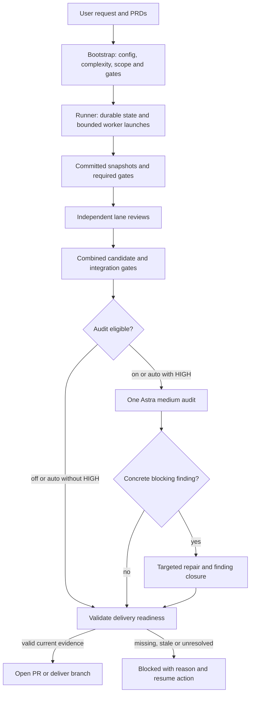
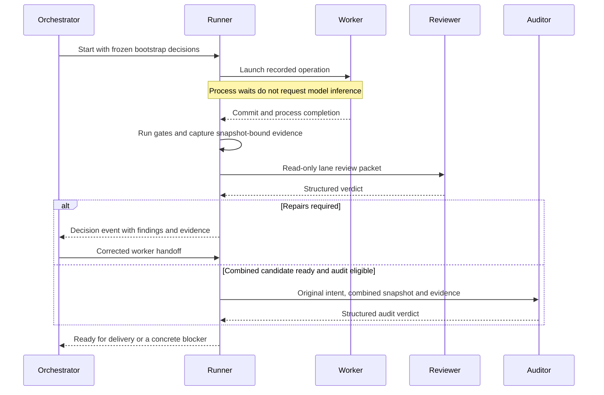

# Deterministic execution, trustworthy evidence, and selective auditing

**Complexity: 7 → HIGH mode**

Score: 3 for more than ten affected files, 2 for a new runner module, and 2 for concurrent execution and durable state transitions. The phases are sequential because they share the CLI and test registry.

**Goal:** make Linchpin cheaper and more effective by removing repetitive model supervision, binding approval to the actual delivered code, and spending an expensive auditor call only where the declared complexity warrants it.

**Status:** planning only. This document does not authorize implementation, model experiments, branch creation, or PR delivery.

## Product decisions

```toml
worker = "luna"
worker_effort = "max"
reviewer = "sol"
reviewer_effort = "medium"
audit = "auto"           # on | off | auto
auditor = "astra"        # existing model alias resolution
auditor_effort = "medium"
```

| Mode | Meaning | Default behavior |
|---|---|---|
| `auto` | Audit HIGH-complexity PRDs only, using the complexity recorded at bootstrap. | Shipped default; HIGH means score 7 or greater. |
| `on` | Audit the batch regardless of PRD complexity. | Explicit opt-in for an otherwise ineligible batch. |
| `off` | Do not launch or preflight an auditor for this run. | Explicit override; ordinary review and required gates remain. |

The orchestrator reads the complexity declaration near the top of each PRD. If it is missing, the orchestrator assesses complexity during bootstrap using the existing creator rubric and records the score, contributing factors, and reasoning in the run record. It does not rewrite the source PRD or ask the user to classify routine work.

**Astra medium is the default auditor, not the default executor or reviewer.** Its provider and model slug resolve through `references/runtime.md` and the existing alias registry. Both model and effort remain configurable. There is no automatic model escalation.

Examples:

| User request | Effective policy for this run |
|---|---|
| `execute XYZ with @linchpin` | Repository setting, otherwise `auto`. |
| `execute XYZ with @linchpin but leave auditor off` | `off`; do not persist this override. |
| `execute XYZ with @linchpin and use an auditor` | `on`; use the configured auditor model. |
| `execute XYZ with @linchpin using auditor auto` | `auto`; use the bootstrap complexity assessment. |
| `use Sol high as auditor for this run` | Run-local auditor role override; retain the effective audit mode unless the request also enables it. |

Precedence is explicit run override, then repository configuration, then shipped defaults. A request to change the repository default must explicitly express persistence. Contradictory on/off instructions fail with one concise clarification before a paid process is launched. No enum named `risk`, probability slider, or sampling mode ships in this iteration.

## Context and mined evidence

The investigation sampled 17 parent Codex sessions with Linchpin execution requests from September 1–4, 2026, local time. A README-edit session and a mixed plugin-development session were excluded. Counts describe the captured sessions, including resumed work; they are not a controlled comparison of complete batches.

| Observation | Evidence | Design consequence |
|---|---|---|
| Repeated supervision remains common despite existing instructions. | 1,028 `write_stdin` invocations and 403 outer calls containing log reads across the sample. Some calls supported necessary testing; they are not all waste. | Move unchanged process waiting and log collection into deterministic code. |
| Large context is repeatedly processed. | Latest cumulative parent counters summed to 312,940,704 input tokens, including 305,142,656 cached tokens, and 906,386 output tokens. | Measure cached and uncached input separately; reduce repeated model turns and raw-log ingestion. |
| The behavior persists on 0.11.0. | Production-error session `01a06f78-1407-7340-884e-69f12c1113d2` contained 40 `write_stdin` calls and 38 log-reading calls. | Stronger prose alone is insufficient; the runner must own waiting. |
| Broad correctness errors can survive local implementation work. | PRD-357 session `01a06f66-f72a-7fa0-9763-4d45f0ef8f51`: the manager corrected an incomplete duplicate inventory and a false historical-baseline explanation. Corrected inventory: 207 groups and 369 redundant paths. | Give the auditor original intent, combined changes, scope and independent evidence, rather than another line-by-line lane review. |
| Review loops and launch failures are mixed together. | Documentation session `01a064f1-0919-76f0-b90b-3e6167d3fd00` showed repeated reviewer launch attempts. Existing `tests/one-review-per-lane.sh` also documents the earlier repeated-review failure motivating its cap. | Count attempts separately from completed substantive reviews and bound both. |

These numbers are not billing totals or unique text volume. They exclude child worker/reviewer usage; reasoning tokens are a subset of output, not an additional chargeable count to add again. The data does not establish an optimal audit frequency, causal savings, or Astra's advantage over Sol. The proposed threshold and cadence are hypotheses to evaluate.

### Incumbent census

| Existing owner | Current responsibility or gap | Replacement boundary |
|---|---|---|
| `scripts/linchpin.sh:2355` and `scripts/linchpin.sh:2469` | Detached launch and group waiting. The manager still constructs commands and repeatedly reads state. | Keep these mechanisms; put deterministic lifecycle ownership above them. |
| `skills/prd-swarm-coordinator/SKILL.md:76` | Model-driven assembly of worktrees, launches, gates, reviews and ledger updates. | The coordinator invokes the runner and handles semantic decisions. |
| `scripts/linchpin.sh:1060` | `review-brief` increments rounds while generating a packet, before successful review. | Pure packet generation; attempt accounting and accepted-verdict accounting are separate. |
| `scripts/linchpin.sh:2566` | `lane` verifies a commit exists, but delivery primarily checks field presence and gate-file existence. | Shared readiness validation checks the exact snapshot and typed evidence. |
| `references/runtime.md` and `references/intake.md` | Role resolution, invocation, options and routing already exist. | Extend them; do not create a second provider/model registry. |

Line numbers are planning anchors in the current checkout. Implementation checkpoints must update the Integration Ledger to the actual resulting non-test callers.

## Scope and architecture

The existing shell CLI remains the entry point. Add small shell modules using the repository's existing `jq` dependency; do not introduce a database service, framework, Python dependency, or replacement agent platform. Keep implementation model selection and worktree conventions intact.

The runner owns process lifecycle, bounded scheduling, gate execution, evidence intake, audit eligibility, and delivery readiness. The model orchestrator owns PRD interpretation, missing complexity assessment, integration decisions and actionable repair handoffs. Workers implement; reviewers inspect lanes; the auditor inspects the batch's original intent, integration and assumptions.





### CLI and durable state contract

Expose `run`, `events`, `result`, `ready`, and `stats` through `scripts/linchpin.sh`; `run` accepts `--resume RUN_ID`, `--audit on|off|auto`, and `--bootstrap PATH`. `run --bootstrap` consumes the orchestrator's validated plan: PRD paths/hashes, resolved complexity, file sets, groups, worktree/base choices, exact gate argv and applicable delivery stage. It must reject incomplete bootstrap state rather than guess commands.

`run` starts or reconnects to one detached local runner and returns a run identifier and event cursor. `events RUN_ID --after CURSOR --wait` blocks inside deterministic code until a meaningful state change, terminal state, or timeout. Timeout output is a heartbeat, not an instruction to ask a model to reason. Where the host cannot deliver background notifications, use its existing bounded tool-wait mechanism and report that limitation; do not claim zero host turns. No repeated full-log reads are required for progress.

| Artifact under `<repo>/.linchpin/runs/<run-id>/` | Owner and content |
|---|---|
| `state.json` | Authoritative versioned state: frozen config, complexity, lane/snapshot identities, operations, counters and decisions. |
| `events.jsonl` | Append-only bounded structured events with monotonic cursor, state revision and operation identity. Rebuildable from durable state transitions if a crash interrupts projection. |
| `operations/<id>/` | Launch receipt, provider/session identity, process identity, exit receipt, raw log, usage and validated result. |
| `evidence/<id>.json` | Snapshot-bound gate, review, audit or closure record with referenced raw-artifact digests. |
| `run.md` | Human-readable projection retaining the existing terminal vocabulary; never an independent source of approval. |

Use one writer per run, an atomic directory lock, and same-filesystem temporary-file rename for state publication. Record operation intent before launch; the child writes a receipt before invoking the provider. Record PID plus process start identity, session and operation ID. PID reuse is not proof of a live operation. Concurrent `run --resume` invocations cannot launch duplicate paid work.

A crash in an ambiguous launch window yields `launch_uncertain`; reconcile receipts and provider/session state or require a concrete operator decision. Do not blindly relaunch or promise exactly-once remote execution without a provider idempotency guarantee. A completed result is accepted once by operation ID. Raw logs stay on disk; ordinary events carry identities and concise reasons, with bounded failure excerpts only when needed.

Keep `launch`, `await`, `brief`, `lane` and `status` compatible as interfaces, delegating to common invariants where applicable. In particular, `lane --set state=DELIVERED(...)` must not bypass the same `ready` validation used by the runner. Existing ledgers remain readable; importing one produces unverified evidence until provenance is reconstructed. Never silently convert historical free-form approvals into current approvals.

### Evidence and review contract

Define a canonical snapshot identity from repository identity, resolved base/head commit vector, PRD hashes, required gate definitions, lockfile/runtime fingerprints, and relevant declared environment inputs. For cross-repository batches use an ordered vector of repository and commit identities. Never store secret environment values; use documented non-secret fingerprints or digests. Source checks run against clean, stable snapshots; worker mutation during verification invalidates results.

Gate records include exact argv and working directory identity, command definition digest, exit code, start/end timestamps, snapshot identity, environment fingerprint and raw-output digest. Baseline controls have separate keys from candidate checks. Reuse is allowed only for identical relevant inputs. External observations need explicit freshness constraints; missing freshness rules mean no cache reuse. Commit, PRD, command or relevant environment changes invalidate affected evidence.

Reviews and audits return a versioned structured envelope containing run, lane/batch, operation, role, reviewed snapshot, verdict and findings. Findings have stable IDs, type, consequence, location or acceptance criterion, and required closure evidence. Accept only a complete result from the matching finished operation; nonzero exit, truncated output, invalid schema, mismatched snapshot or unknown verdict is not approval. Provider output adapters extract the envelope from the provider's completed output rather than trusting a manager summary.

| Classification | Delivery behavior |
|---|---|
| `DEFECT` | Blocks until concrete repair and independent closure. |
| Missing required PRD verification | Blocks the applicable delivery/release stage regardless of model verdict. |
| Optional `EVIDENCE-GAP` | Recorded advisory; does not introduce an undeclared gate. |
| Architectural preference without violated requirement | Follow-up suggestion, not an automatic blocker. |

Preserve the difference between opening a PR and release completion. A required staging or observation gate that is explicitly post-deployment does not prevent opening a PR unless the PRD says it must; it does prevent claiming release completion or moving that PRD to done. Missing machine-readable sections do not remove requirements present in the PRD's prose or linked documents.

Make `review-brief` side-effect free and repeatable. Track `launch_attempts`, `completed_reviews`, and `failed_repairs` independently. A valid substantive review result consumes a review round, including REQUEST_CHANGES; packet construction and pre-model launch failures do not. Keep one ordinary review plus at most one deliberate follow-up per lane. Allow at most one automatic retry for a demonstrably pre-model environment failure; uncertain or post-model failures require an explicit decision and remain metered. Repair failures require observed failure of the corrected behavior or acceptance condition; quota and setup failures are not failed code repairs.

### Complexity and audit eligibility

Read a numeric complexity declaration and label from the PRD's opening metadata. Accept the creator's current bold Markdown form as well as its plain-text equivalent. A numeric score takes precedence over an inconsistent label; emit and record a visible discrepancy. A recognized HIGH/MEDIUM/LOW label without a score may supply the declared classification, but record that no numeric score was supplied. Malformed, contradictory or absent declarations require the orchestrator's bootstrap assessment before auditor eligibility is frozen.

The assessment uses the creator rubric: mutually exclusive file-count contribution (1–5 files: 1; 6–10: 2; more than 10: 3), plus new system/module (2), complex concurrency/state (2), multi-package changes (2), database schema (1), external API integration (1). Record each applicable factor with the evidence that justified it. Do not inflate a single conceptual change by counting generated files or counting the same category twice. Legacy PRDs remain unmodified.

| Effective mode | Batch classification | Result |
|---|---|---|
| `off` | Any | No auditor capability check, provider probe, launch or audit gate. |
| `on` | Any | One batch audit becomes required at its checkpoint. |
| `auto` | At least one HIGH PRD | Audit eligible lanes and their interacting integration scope together. |
| `auto` | All LOW/MEDIUM | Ordinary review only. |
| `auto` | Missing classification | Orchestrator assesses once during bootstrap; no silent low default. |

The count is per logical batch, not per PRD, lane, commit, time interval or polling cycle. Multiple eligible lanes share an audit after integration. Include interacting lower-complexity lanes in the combined scope, but do not repeat deep review of unrelated low-complexity work. Preflight the auditor only after eligibility resolves, before implementation starts for eligible runs. Ineligible runs must not fail because the unused auditor model is unavailable.

### Auditor checkpoint and cost boundary

**Normal path:** one audit after lane reviews and combined required gates, before opening the PR or delivering the branch. The auditor is the final broad independent review when enabled. It verifies original intent, cross-lane behavior, scope completeness, baseline assumptions and evidence provenance. It does not repeat all local reviewer work or repair code.

**Early diagnostic exception:** after two unsuccessful repairs in the same eligible scope, the orchestrator may spend that same audit allowance diagnosing a named unresolved assumption or concrete disagreement. This is not an additional automatic audit. Low-complexity work in `auto` does not gain an auditor through this exception; the user can explicitly turn auditing on.

Default ceiling: **one completed substantive audit per stable logical batch**, with at most one automatic retry for a proven pre-model environment failure. Deduplicate simultaneous final-ready and stalled-repair triggers. Persist the ceiling against the batch lineage; renaming a lane, changing a worktree or resuming cannot reset it. Any paid attempt remains in usage records, even when it produces no valid verdict.

An early diagnosis is not final approval of code written afterward. An auditor finding receives a targeted worker handoff. Required gates rerun on the final snapshot; an independent reviewer may use its remaining review allowance to verify the repair delta and close each finding against that snapshot. Record this as `audit completed; final repair closure verified`, not `auditor approved final commit`. The auditor remains the last broad review, while targeted closure may follow.

If repairs change the audited integration assumptions or scope, or the reviewer has no remaining allowance, delivery is BLOCKED with the exact missing verification and a resumable action. A second substantive audit or further review requires an explicit, logged budget extension for the same batch; neither a new lane identity nor `audit on` silently resets spent allowance. No stale approval and no unlimited audit/repair loop is acceptable.

The initial packet targets 8,000 task-specific input tokens, excluding shared platform instructions. Include original acceptance wording, combined diff index, interfaces, unresolved findings and evidence references. Keep raw logs and the manager transcript out of the initial packet. Required content is never silently truncated: an oversized packet is visibly measured and split or expanded through targeted source reads, with usage metered. This target is not a hard API billing limit. Do not claim enforcement of a token ceiling that the provider CLI cannot enforce.

### Measuring whether it pays for itself

Record usage by provider, actual model/effort, role, operation and session. Normalize cumulative counters using deltas or the final operation total once. Do not count reasoning output twice, count parent totals as child usage, or turn unavailable usage into zero. Parent-manager usage is reported only when available through an explicit session association; otherwise label the report partial.

`stats RUN_ID` reports model invocations during unchanged waits, usage by role, cached/uncached input, output, time to delivery, repairs, audit attempts, unique actionable audit findings, duplicate/rejected findings, and delivery outcome. An estimated monetary cost requires a supplied versioned price table; otherwise show tokens with `cost unavailable`. Cost per accepted batch includes failed attempts attributable to that batch. Late defects and avoided repairs require recorded human/outcome evidence, not a model's unsupported estimate.

First prove deterministic waiting and evidence correctness using fixed provider outputs in realistic replay fixtures. Then, after separate authorization to execute a pilot, evaluate the first 20 eligible batches, recording scope and model mix. Compare the executor/reviewer baseline with audited outcomes where comparable evidence exists. Treat this as a descriptive pilot, not statistical proof. Keep the score 7 threshold initially; change frequency only after measuring useful unique findings and total effort. No claimed percentage savings is an acceptance condition.

## Integration Ledger

| # | New thing | Live caller (`file:line`, non-test) | Replaces | Old path removed? | Negative control |
|---|---|---|---|---|---|
| 1 | Audit config, bootstrap classification and run override policy in `scripts/audit-policy.sh` | `scripts/linchpin.sh:1283` and `scripts/linchpin.sh:849` resolve config; `scripts/linchpin.sh:3316` dispatches run policy; `scripts/linchpin.sh:1480` decides eligibility | Manager guessing audit eligibility | Old inference replaced in Phase 1 | Disable policy dispatch; auto HIGH and off override controls fail. |
| 2 | Auditor role metadata and provider resolution | `scripts/linchpin.sh:229` resolves roles; `scripts/linchpin.sh:2127` preflights eligible roles | No auditor role | New role; existing resolver retained in Phase 2 | Remove auditor row; eligible preflight refuses while off remains usable. |
| 3 | Run-local sentence overrides | `skills/linchpin/SKILL.md:39` routes request to `scripts/linchpin.sh:2003` | Persistent-only assignment path for transient requests | Existing explicit persistent assignment retained; transient dispatch added in Phase 2 | Request auditor off, then verify repo configuration is byte-identical. |
| 4 | Runner state, events, operation receipts and Markdown projection | `scripts/linchpin.sh:3078` delegates lifecycle to `scripts/runner.sh`; coordinator `skills/prd-swarm-coordinator/SKILL.md:76` invokes CLI | Reconstructed launch commands and model polling | Coordinator path delegates in Phase 3 | Remove runner delegation; resumed worker is not recovered and the live CLI test fails. |
| 5 | Snapshot-bound gates, reviews and delivery readiness in `scripts/evidence.sh` | `scripts/linchpin.sh:2566` validates delivery; `scripts/linchpin.sh:1674` validates gates | Presence-only approval and evidence checks | Reduced to shared validation in Phase 4 | Reuse old approval after a commit change; ready must fail. |
| 6 | Pure review packets, typed results and bounded counters | `scripts/linchpin.sh:1060` builds review packets; runner result intake reached through `scripts/linchpin.sh:3078` | Brief-generation round consumption and free-form approval | Replaced in Phase 5 | Generate packet twice, then inject malformed verdict; neither may consume a completed round. |
| 7 | Batch audit packet, trigger coalescing and finding closure | Runner invoked at `scripts/linchpin.sh:3078`; final-review handoff at `skills/prd-swarm-coordinator/SKILL.md:197` | No independent combined audit; ad hoc manager diagnosis | Coordinator delegates in Phase 6 | Remove audit readiness check; eligible batch would ship without required audit and control fails. |
| 8 | Per-operation usage and `stats` projection in `scripts/usage.sh` | `scripts/linchpin.sh:3078` dispatches stats and runner completion records usage | Unattributed session totals and guessed savings | Stats becomes shared reporting path in Phase 7 | Replay the same cumulative usage event twice; totals must not double. |
| 9 | Policy examples and integrated regression gate | `skills/linchpin/SKILL.md:39` and `skills/prd-swarm-coordinator/SKILL.md:26` drive documented commands | Stale one-versus-two review prose and hand-built orchestration instructions | Conflicting paths removed in Phase 8 | Break documented auto/off path; integrated CLI regression fails. |

## Execution Phases

All listed tests below are planned implementation work. Test names use `should ... when ...`; the negative-control specifications are not evidence that those tests already exist or passed.

### Phase 1: A user can see why a PRD will or will not be audited

**Files (5):**

- `scripts/linchpin.sh` - EDIT: config and bootstrap policy dispatch, mode validation and run-local override precedence.
- `scripts/audit-policy.sh` - NEW: complexity declaration parsing, assessment validation and deterministic eligibility decisions.
- `references/intake.md` - EDIT: on/off/auto semantics, bootstrap scoring, persistence and precedence.
- `tests/audit-policy.sh` - NEW: public CLI decision-table and malformed declaration controls.
- `tests/run-all.sh` - EDIT: register audit-policy tests in the shipped suite.

Implement the exact mode table and score rubric above. Emit a user-readable reason with effective mode, complexity, source and eligibility. Missing assessment yields `BOOTSTRAP-NEEDS-COMPLEXITY` for the orchestrator to resolve; it is not a demand for user input. Freeze the resulting decision in bootstrap JSON. Unknown mode values fail before launch.

**Wiring:** existing config/dispatch functions call the policy module; replace improvisation in intake. Ledger row 1 receives resulting caller lines. No model invocation is needed for a valid declaration.

| Test file | Test name | Assertion | Negative control |
|---|---|---|---|
| `tests/audit-policy.sh` | should select only HIGH PRDs when mode is auto | Scores 6/7, bold declarations, mixed batch and missing assessment produce exact outcomes. | Disable policy dispatch and run the same CLI cases. |

**Verification Plan:** `sh tests/audit-policy.sh`. **User Verification:** resolve a score-6 and score-7 bootstrap in auto; only the second prints auditor eligible. **Revert check:** disabling the wired policy breaks that CLI flow. Record checkpoint before Phase 2.

### Phase 2: A user can select the auditor and turn it off for one run

**Files (5):**

- `scripts/linchpin.sh` - EDIT: auditor model resolution, eligible preflight and non-persistent sentence overrides.
- `references/runtime.md` - EDIT: Auditor role default, provider mechanisms, effort and role boundaries.
- `skills/linchpin/SKILL.md` - EDIT: route transient audit requests without writing repository config.
- `tests/auditor-runtime.sh` - NEW: Codex/Claude role resolution and sentence precedence through public commands.
- `tests/run-all.sh` - EDIT: register auditor-runtime tests.

Add the Auditor row using Astra medium through the existing alias table. Reuse the existing read-only provider mechanisms; test repository writes are refused under the actual supported mechanism before calling it a read-only guarantee. Role selection does not itself change audit eligibility. An eligible unavailable model refuses with its name; off/ineligible runs make zero auditor probes. Keep worker and reviewer defaults unchanged.

**Wiring:** runtime/preflight and router entry points use the policy result; ledger rows 2–3 resolved. Explicit persistent changes retain the existing assignment mechanism, while run-local options are passed in bootstrap state.

| Test file | Test name | Assertion | Negative control |
|---|---|---|---|
| `tests/auditor-runtime.sh` | should avoid auditor cost when a sentence disables it | No auditor probe/launch; config bytes unchanged; worker/reviewer still resolve. | Force auditor preflight despite off and assert the probe-count test fails. |

**Verification Plan:** `sh tests/auditor-runtime.sh`. **User Verification:** dry-resolve the user's “leave auditor off” sentence and inspect mode/provenance and unchanged config. **Revert check:** remove router override transfer; the off test fails. Record checkpoint.

### Phase 3: A resumed run continues without duplicate launches or model polling

**Files (5):**

- `scripts/linchpin.sh` - EDIT: run/events dispatch and reuse of launch/await lifecycle primitives.
- `scripts/runner.sh` - NEW: durable single-writer state, operation receipts, scheduling, resume and events.
- `skills/prd-swarm-coordinator/SKILL.md` - EDIT: invoke runner and consume decision events instead of assembling lifecycle commands.
- `tests/runner-lifecycle.sh` - NEW: process recovery, concurrency, meaningful events and no-change waiting tests.
- `tests/run-all.sh` - EDIT: register runner-lifecycle tests.

Implement atomic state and cursor semantics, lock ownership, process identity and ambiguous-launch handling. Preserve max-lane limits and per-group isolation. A fake provider records each actual invocation and emits deterministic outputs; tests invoke the real runner CLI, not private helper functions. Cover crash before receipt, crash after launch, duplicate result, two concurrent resumes and PID reuse.

**Wiring:** existing coordinator start path delegates to run/events; ledger row 4 resolved. Existing launch/await remain primitive implementations, not a parallel coordinator. Waiting inside the runner cannot request a model call.

| Test file | Test name | Assertion | Negative control |
|---|---|---|---|
| `tests/runner-lifecycle.sh` | should reconnect once when two resumes target a running lane | One provider invocation, monotonic events, stable operation ID and bounded wait output. | Disable launch deduplication and observe duplicate invocation failure. |

**Verification Plan:** `sh tests/runner-lifecycle.sh`. **User Verification:** start and resume a fixture batch twice; see one operation and one completion. **Revert check:** disconnect run dispatch and observe the public start/resume scenario fail. Record checkpoint.

### Phase 4: A changed commit cannot ship on old evidence

**Files (5):**

- `scripts/linchpin.sh` - EDIT: ready/result dispatch and delivery checks shared with lane/gate commands.
- `scripts/evidence.sh` - NEW: snapshot identities, evidence intake, cache keys and readiness validation.
- `scripts/runner.sh` - EDIT: stable-snapshot gate execution and typed evidence collection.
- `tests/evidence-provenance.sh` - NEW: stale commit/environment, missing required checks and delivery bypass tests.
- `tests/run-all.sh` - EDIT: register evidence-provenance tests.

Implement snapshot vectors and exact gate records. Treat linked/prose PRD requirements according to the bootstrap gate plan and applicable lifecycle stage. Gate reuse requires matching inputs and freshness. Both ready and manual lane delivery refuse free-form `review=banana`, arbitrary existing gate files and old approvals. Legacy status remains readable without manufacturing verified provenance.

**Wiring:** existing lane delivery and gate paths call evidence validation; ledger row 5 resolved. The former presence-only condition is removed from all delivery paths.

| Test file | Test name | Assertion | Negative control |
|---|---|---|---|
| `tests/evidence-provenance.sh` | should refuse delivery when an approval names the previous commit | Commit, PRD, gate definition and environment changes invalidate relevant evidence. | Bypass snapshot comparison and observe stale-approval acceptance fail the test. |

**Verification Plan:** `sh tests/evidence-provenance.sh`. **User Verification:** approve fixture commit A, make commit B, then run ready; receive the exact stale evidence reason. **Revert check:** restore presence-only delivery and watch the stale-approval CLI case fail. Record checkpoint.

### Phase 5: Review budget reflects actual reviews rather than packet generation

**Files (5):**

- `scripts/linchpin.sh` - EDIT: pure review-brief generation and review attempt/result interfaces.
- `scripts/runner.sh` - EDIT: typed verdict intake, retry classification and completed-review counters.
- `scripts/evidence.sh` - EDIT: verdict validation, stable findings and required versus optional evidence handling.
- `tests/one-review-per-lane.sh` - EDIT: replace brief-counter expectations with completed-result and bounded-attempt controls.
- `references/runtime.md` - EDIT: reconcile one ordinary review with one deliberate follow-up and forbid self-repair by reviewers.

Count a valid completed verdict once, including rejection; duplicate result intake is idempotent. Generate a packet twice without consuming a round. Reject malformed and unbound results without approval. Enforce the finite retry rules and existing two-review ceiling; record repair failures separately. An EVIDENCE-GAP label cannot bypass required verification.

**Wiring:** review-brief and runner intake share the new counters; ledger row 6 resolved. Delete the increment during brief generation and inconsistent runtime statements.

| Test file | Test name | Assertion | Negative control |
|---|---|---|---|
| `tests/one-review-per-lane.sh` | should spend one round when a valid result is accepted twice | One completed review; regenerated packets spend none; third substantive review refuses. | Restore packet-time increment and observe the duplicate-generation assertion fail. |

**Verification Plan:** `sh tests/one-review-per-lane.sh`. **User Verification:** generate two packets, receive one real verdict, inspect rounds = 1. **Revert check:** original counter behavior fails that existing test entry point. Record checkpoint.

### Phase 6: Eligible batches receive one independent combined audit

**Files (5):**

- `scripts/runner.sh` - EDIT: normal/diagnostic audit checkpoints, trigger coalescing and batch-lineage budget.
- `scripts/evidence.sh` - EDIT: audit packets, finding closure and explicit final-snapshot provenance.
- `skills/prd-swarm-coordinator/SKILL.md` - EDIT: audit handoff, targeted repairs and honest blocked/closure states.
- `tests/audit-checkpoints.sh` - NEW: mixed-batch, early diagnosis, exhausted-budget and final-delivery scenarios.
- `tests/run-all.sh` - EDIT: register audit-checkpoints tests.

Prove the capability using a PRD-357-derived fixture with an incomplete inventory, wrong baseline explanation and integration replay, plus an API/client batch whose individual lane checks pass but combined behavior is wrong. The auditor receives original requirements and independently inspectable artifacts. A fake role response is acceptable for deterministic orchestration tests; it is not evidence of model detection quality.

**Wiring:** runner routes eligible ready batches through audit before ready can succeed; ledger row 7 resolved. Audit findings go to the worker through an explicit corrected handoff. Neither manager prose nor budget exhaustion supplies approval.

| Test file | Test name | Assertion | Negative control |
|---|---|---|---|
| `tests/audit-checkpoints.sh` | should spend one audit when several HIGH lanes become ready | One combined audit, correct commit vector, no low-only auto audit, off wins. | Remove trigger coalescing and observe duplicate auditor calls. |
| `tests/audit-checkpoints.sh` | should block stale audit approval when repairs change integration assumptions | Diagnostic result never approves later code; scope-changing repair requires explicit continuation. | Reuse the old audit snapshot and observe readiness incorrectly passing. |

**Verification Plan:** `sh tests/audit-checkpoints.sh`. **User Verification:** run a mixed fixture batch and inspect one audit event and an accurate final closure state. **Revert check:** remove audit readiness wiring and the eligible missing-audit flow fails. Record checkpoint.

### Phase 7: Users can inspect actual model usage and audit value

**Files (5):**

- `scripts/linchpin.sh` - EDIT: stats dispatch and optional versioned pricing input.
- `scripts/usage.sh` - NEW: per-operation usage normalization, attribution and reporting.
- `scripts/runner.sh` - EDIT: capture provider usage on all attempts and associate findings with closure outcomes.
- `tests/usage-accounting.sh` - NEW: cumulative counter replay, unknown usage, mixed-provider and failed-attempt accounting.
- `tests/run-all.sh` - EDIT: register usage-accounting tests.

Implement the measurement contract without network pricing lookups. Emit partial coverage when parent or provider usage is unavailable. Include all attributable failed attempts in totals and prevent counting the same session through both parent and child associations. Reports distinguish observed useful findings from unverified claims about avoided defects.

**Wiring:** stats is reachable from the CLI and runner completion records usage; ledger row 8 resolved. The printed report derives from persisted operations, not a narrative estimate.

| Test file | Test name | Assertion | Negative control |
|---|---|---|---|
| `tests/usage-accounting.sh` | should count cumulative usage once when a session is replayed | Same totals after replay; reasoning is not added to output; missing usage remains unknown. | Sum cumulative snapshots and observe double-count assertion fail. |

**Verification Plan:** `sh tests/usage-accounting.sh`. **User Verification:** request stats for a fixture with one failed attempt and one success; both appear with coverage and unavailable-cost labels. **Revert check:** remove runner usage capture and the report loses its expected operations. Record checkpoint.

### Phase 8: The documented user flow proves the complete design

**Files (5):**

- `README.md` - EDIT: modes, default Astra medium, examples, lifecycle and honest measurement limits.
- `references/intake.md` - EDIT: final CLI/bootstrap schema and override examples aligned with implementation.
- `tests/runner-end-to-end.sh` - NEW: realistic fixed-output replay through request, bootstrap, execution, review, audit and readiness.
- `tests/run-all.sh` - EDIT: register end-to-end replay.
- `scripts/verify.sh` - EDIT: verify runner wiring, role policy references and absence of conflicting lifecycle instructions.

Run the PRD-357 and production-error-derived replay subjects with fixed role outputs and explicit expected event/model-call counts. The unchanged-wait segment must add zero model invocations; identical required gates and delivery decisions remain enforced. Cover auto HIGH, auto MEDIUM, explicit on/off, missing header assessed by orchestrator, and resume after an interrupted result. All phase tests run in the existing suite.

**Wiring:** documented commands exercise the real router/CLI; ledger row 9 resolved. Replace stale manual-launch instructions where earlier phases introduced the runner; no second live orchestration recipe remains.

| Test file | Test name | Assertion | Negative control |
|---|---|---|---|
| `tests/runner-end-to-end.sh` | should preserve delivery requirements while avoiding idle model calls | Real-derived replay reaches the expected outcome with unchanged mandatory gates and zero idle inference. | Disconnect runner path and observe event/call-count mismatch. |

**Verification Plan:** `sh tests/runner-end-to-end.sh`, `sh tests/run-all.sh`, and `sh scripts/verify.sh`. **User Verification:** follow the README off example and see no audit; run HIGH auto and see one final combined audit. **Revert check:** disabling runner dispatch breaks this public flow. Record final implementation checkpoint; live pilot remains separately authorized work.

## Negative Controls

**Planned control specifications, not observed results.** The exact command/result strings below describe the required red evidence to capture during implementation. Tests using internal expected-failure helpers may themselves exit zero; their checkpoint must also capture the intentionally broken underlying production command and its nonzero exit. Never report these planned rows as observed PASS.

| Gate | Negative control | Expected red | Exact command/result |
|---|---|---|---|
| policy | Disable policy dispatch in an isolated fixture copy | Public auto/off decision assertions fail | `command: sh tests/audit-policy.sh`; result: RED observed: policy dispatch disabled; exit: 1 |
| auditor-runtime | Force auditor preflight despite off | Disabled-auditor probe count assertion fails | `command: sh tests/auditor-runtime.sh`; result: RED observed: disabled auditor probed; exit: 1 |
| lifecycle | Disable launch deduplication | Concurrent resume invokes provider twice and fails | `command: sh tests/runner-lifecycle.sh`; result: RED observed: duplicate launch accepted; exit: 1 |
| provenance | Bypass snapshot equality | Stale approval is incorrectly accepted and test fails | `command: sh tests/evidence-provenance.sh`; result: RED observed: stale approval accepted; exit: 1 |
| review-budget | Restore packet-time round consumption | Duplicate packet generation violates round count | `command: sh tests/one-review-per-lane.sh`; result: RED observed: packet generation spent review; exit: 1 |
| audit-checkpoint | Remove audit readiness guard | Eligible unaudited candidate is wrongly ready | `command: sh tests/audit-checkpoints.sh`; result: RED observed: missing audit accepted; exit: 1 |
| usage | Sum repeated cumulative counters | Replayed usage is double-counted | `command: sh tests/usage-accounting.sh`; result: RED observed: cumulative usage counted twice; exit: 1 |
| integration | Disconnect runner dispatch | Documented real-derived replay fails | `command: sh tests/runner-end-to-end.sh`; result: RED observed: runner disconnected; exit: 1 |
| suite-collection | Insert a deliberate failure in a registered new test | Shipped suite collects it and fails | `command: sh tests/run-all.sh`; result: RED observed: registered test deliberately failed; exit: 1 |
| verifier | Remove required runtime Auditor role reference | Repository verifier identifies missing policy | `command: sh scripts/verify.sh`; result: RED observed: auditor role reference removed; exit: 1 |

## Acceptance Criteria

- [ ] A user executing a HIGH PRD with default configuration sees `auto`, the recorded complexity source, Astra medium, and one combined audit checkpoint. A LOW/MEDIUM-only batch sees ordinary review without auditor calls. Missing complexity is assessed by the orchestrator during bootstrap without editing the PRD.
- [ ] A user saying “leave auditor off” gets zero auditor probes and calls for that run, unchanged persistent config, and unchanged required gates. Explicit on and custom auditor model/effort resolve through the same documented options and provider registry.
- [ ] Resuming the same batch cannot duplicate a paid operation or reset its budget. Unchanged waiting requires no model inference inside the runner. Ambiguous launches, unavailable usage and host notification limits are reported accurately.
- [ ] A delivered candidate has required current gate evidence, valid current review/closure provenance, and the applicable audit or explicit off/ineligible state. Old-commit approvals, malformed verdicts, missing required checks and exhausted unverified repairs cannot pass readiness through any CLI entry point.
- [ ] All eight phase checkpoints, Integration Ledger callers, negative controls and existing regression checks have real recorded evidence. Users can inspect per-role usage and audit findings; no live-model effectiveness or monetary savings is claimed from stubbed replay. The separately authorized pilot reports results before frequency changes are proposed.

## Checkpoint Protocol

After each phase, record the exact commands, exit codes, collected test names and relevant output in a verification artifact associated with the implementation commit. Each checkpoint includes caller census, the phase revert check, the replaced-path census, and actual observed-red evidence for that phase's gate. Restore the intended implementation and record the subsequent passing checks. Run mutations only in isolated fixture copies; never break unrelated live work.

For caller census use `rg -n` on each introduced module/function in `scripts/` and `skills/`, identify the real non-test consumer, and update the Integration Ledger. For incumbent census inspect the coordinator and CLI to verify replaced logic is removed or delegates. A module whose only consumer is a test fails its checkpoint.

The final automated implementation checkpoint runs `sh tests/run-all.sh` and `sh scripts/verify.sh`, with the repository's model-cache fixtures as required by existing CI. Required checks with no observed red remain UNVERIFIED. Structural conformance of this PRD does not prove implementation conformance or gate effectiveness.

One manual implementation checkpoint uses an explicitly authorized disposable batch to verify actual provider behavior, including read-only role enforcement, final evidence provenance and delivery preview. A separate authorized pilot of 20 eligible batches evaluates cost and useful findings; unavailable provider access or usage is recorded as a limitation, not replaced by fabricated success. Neither checkpoint runs while authoring this PRD.

## Verification Evidence

Contract conformance: prd_contract: v1.

Authoring check: `sh scripts/linchpin.sh contract docs/PRDs/runner-evidence-auditor.md` — exit 0; `CONFORMING docs/PRDs/runner-evidence-auditor.md`. This validates document structure only. Implementation, negative controls, provider pilot, branches and PR delivery have not been executed for this PRD.
